# GoldenCompass Developer Guide

## Acknowledgements
Our project, GoldenCompass, was built upon and inspired by several open-source projects, libraries, and resources. We would like to acknowledge the following:

### Core Frameworks and Templates
Gradle: Used as the primary build automation tool for managing dependencies and generating the executable JAR file.

JUnit 5: Used for comprehensive unit testing and ensuring the reliability of our internship and interview tracking logic.
### Libraries and Plugins
PlantUML: Used to generate the sequence and class diagrams throughout the Developer Guide to visualize the system's architecture.

### Instructional Resources
CS2113 Course Website: For providing the guidelines on software engineering principles, testing standards, and documentation formats used in this project.
## Design

### Architecture


### Parser component

The class `Parser` has an immutable class-level attribute `Set<String> FLAGSET` and
two mutable private attributes `String command, Map<String, List<String>> flagToParamMap`.
The essential method of `Parser` is `parse(String userInput)` which parses a string of user input
and stores the result into the attribute `flagToParamMap`. The keys of this map comprise the
first word of the user input (also stored in `command`) and words that are identified as flags in
the `FLAGSET`. The value in this map corresponding to each key word is the parameter string
associated with that key, stored as a `List<String>`, where `List` is used to support duplicated flags.
The class provides getters to get `String command` and `Map<String, List<String>> flagToParamMap`.

More specifically, the parsing procedure works as follows:

1. The input string is trimmed and split by whitespace into an array of words.

2. The first word is treated as the command and stored in command.

3. All occurrences of valid flags defined in `FLAGSET` are identified and their indices in the word array
   are collected using `IntStream`.

4. The indices are used to partition the word array into segments, where each segment corresponds to a key
   (command or flag) and its associated parameter string.

5. Each segment is converted into a `Map.Entry<String, String>`, where the key is the command or flag and
   the value is the concatenated parameter string.

6. The entries are grouped using `Collectors.groupingBy `to form the final `flagToParamMap`, where
   duplicated flags result in multiple parameter strings stored in a list.

This design ensures that:

- the command is always treated as a key in the map,

- each recognized flag maps to its corresponding parameter string,

- parameters can contain multiple words without ambiguity,

- duplicated flags are supported naturally through List<String>.

An example is shown below.

```
Input:
add Google SWE Intern /d 2026-04-03 /t Interview /t Online

Output:
command = "add"

flagToParamMap =
{
"add" -> ["Google SWE Intern"],
"/d"  -> ["2026-04-03"],
"/t"  -> ["Interview", "Online"]
}

```

Noticeably, when the parameters of a flag or the command are empty, the value corresponding to the flag or command
is a `List` of a single empty string, e.g.,

```
Input:
upcoming

Output:
command = "upcoming"

flagToParamMap =
{
"upcoming" -> [""]
}

```

and when the user input is empty string,

```
Input:


Output:
command = ""

flagToParamMap =
{
"" -> [""]
}

```

`Parser` also has a method `public List<String> getParamsOf(String flag)`, which returns the value corresponding
to the key `flag` in the `flagToParamMap`. Importantly, it returns `null` if `flag` does not exist in the key set
of `flagToParamMap`. Thus, it is recommended to call the method `isFlagExist()` to check the existence of the flag
in the user input. If it returns `false`, then the execution of a command should skip or throw a 
`GoldenCompassException` depending on whether the flag is essential for the command.

Below is the sequence diagram illustrating the `class Parser`:

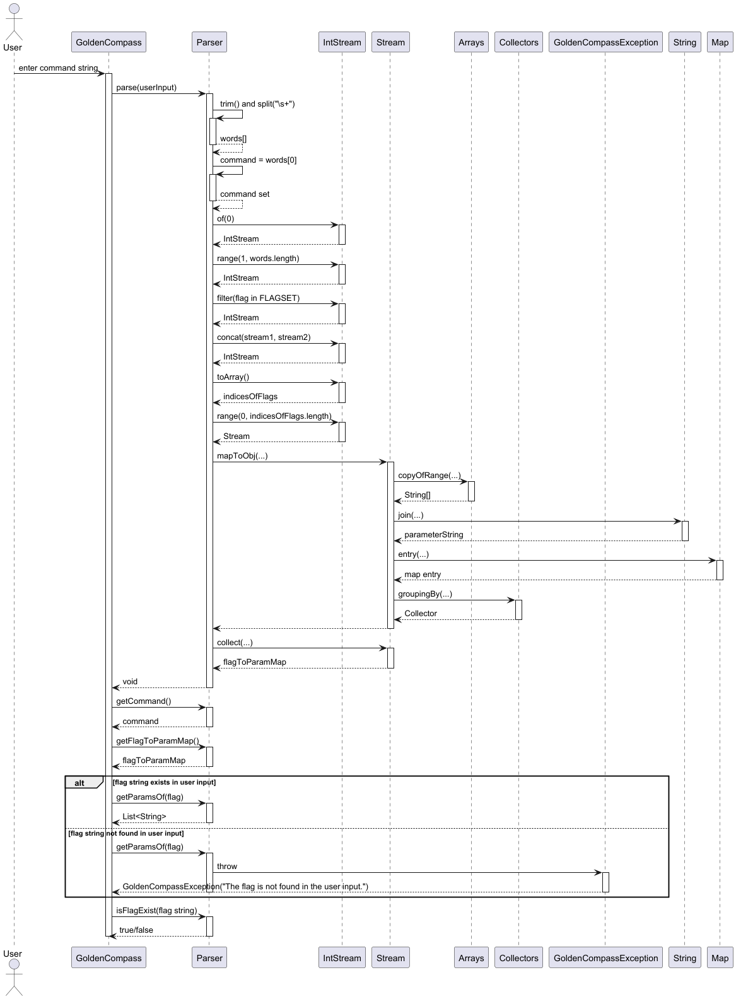

### Executor & Command component


## Implementation

### Internship Management — Class Overview

The following class diagram shows the key classes involved in internship management and their relationships.

Each `AddInternshipCommand` holds a reference to the `Parser` and the `InternshipList`.
The command relies on the `Parser` to extract user inputs and writes the newly created `Internship` directly to the `InternshipList`.

### Add Internship Feature

#### Overview

The `add` command allows the user to create a new internship application in the tracker. The user specifies the company name and the role title, and the system creates a new `Internship` object and appends it to the `InternshipList`.

**Command format:** `add COMPANY_NAME /t ROLE_TITLE`

**Example:** `add Grab /t Software Engineer` creates an internship at Grab for a Software Engineer role.

#### Implementation

The feature is implemented in `AddInternshipCommand`, which extends the abstract `Command` class.

When the user enters `add Grab /t Software Engineer`, the execution flow is as follows:

1. The `Parser` parses the user input, extracting the command word ("add") and its associated parameters.
2. The system looks up the corresponding command and executes `AddInternshipCommand`.
3. `AddInternshipCommand` retrieves the company name parameter using `getParamsOf(parser.getCommand())` and the title parameter using `getParamsOf("/t")`.
4. The command initializes a `StringBuilder` to act as an error message accumulator.
5. The command sequentially checks for a missing company name, a missing `/t` flag, and an empty title string. If any checks fail, a specific error message is appended to the `StringBuilder`.
6. If the `StringBuilder` is not empty after all checks, a single `GoldenCompassException` is thrown containing all accumulated error messages.
7. If validation passes, a new `Internship` object is instantiated using the parsed company name and title.
8. The command calls `internshipList.add(newInternship)` to store the application in memory.
9. The command logs the successful creation and prints a confirmation message to the user via the `Ui`.

The following class diagram shows the main structural components involved in the add internship feature:

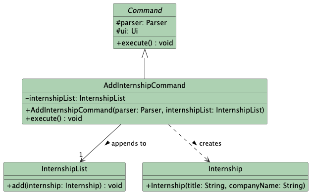

The following sequence diagram illustrates the execution flow when the user enters a valid add command:


#### Input Validation

The command implements an accumulated validation strategy to ensure robustness:

| Validation Layer | Description | Example Error Message |
|-----------------|-------------|----------------------|
| **Company Presence** | Verifies the company name parameter is not empty | "Company name cannot be empty!" |
| **Flag Presence** | Verifies the `/t` flag was parsed successfully | "Invalid flag or missing title! Please use the '/t' flag for the role." |
| **Title Presence** | Ensures the text following the `/t` flag is not blank | "Internship title cannot be empty!" |

#### Defensive Programming Features

The implementation includes several defensive programming measures:

**1. Assertions**: Verify internal state invariants during command initialization.
assert parser != null : "Parser passed to AddInternshipCommand cannot be null";
assert internshipList != null : "InternshipList passed to AddInternshipCommand cannot be null";

**2. Logging**: Track execution flow and record specific user syntax errors for debugging.
logger.log(Level.INFO, "Starting execution of AddInternshipCommand...");
logger.log(Level.WARNING, "Failed to add internship: Company name is missing.");

**3. Error Accumulation**: Instead of failing at the first mistake, the command gathers all input errors into a `StringBuilder` to prevent unexpected partial crashes and provide comprehensive feedback.

#### Design Considerations

**Aspect: Input Validation and Error Handling Strategy**

* **Alternative 1 (Current Implementation): Error Accumulation**
  * **Description:** The command checks all potential failure points (missing company name, missing `/t` flag, empty title) and collects all error messages into a single `StringBuilder`. If the builder is not empty at the end of the checks, it throws one consolidated `GoldenCompassException`.
  * **Pros:** Significantly improves User Experience (UX). If a user makes multiple syntax mistakes, they are informed of all of them at once, rather than having to fix one error just to be immediately hit by another.
  * **Cons:** Slightly more verbose code, as it requires setting up a `StringBuilder` and using `if` blocks that do not immediately return.

* **Alternative 2: Fail-Fast Validation**
  * **Description:** The command throws a `GoldenCompassException` immediately upon encountering the very first invalid input and halts execution.
  * **Pros:** Simpler and shorter code. Execution stops immediately, saving minor amounts of processing time.
  * **Cons:** Frustrating UX. A user who forgets both the company name and the `/t` flag will only see the "missing company name" error. After fixing it and pressing enter, they will be hit with the "missing flag" error, creating an annoying "whack-a-mole" experience.

#### Test Coverage

The feature is covered by comprehensive unit tests to ensure all edge cases are handled:

| Test Case | Description | Expected Outcome |
|-----------|-------------|------------------|
| `execute_validInput_addsInternship` | Execute `add Grab /t SWE` | Internship added to list, list size increases by 1 |
| `execute_missingCompany_throwsException` | Execute `add /t SWE` | Throws `Exception` with missing company message |
| `execute_missingFlag_throwsException` | Execute `add Grab SWE` | Throws `Exception` with missing flag message |
| `execute_missingTitle_throwsException` | Execute `add Grab /t` | Throws `Exception` with missing title message |
| `execute_missingMultiple_throwsException` | Execute `add /t` | Throws `Exception` containing both missing company and missing title messages |

### List Command

#### Overview

The `list` command displays all internship applications currently stored in the tracker. This feature allows users to quickly view their entire internship portfolio with index numbers and current status.

**Command format:** `list`

**Example:** `list` displays all internships with their indices.

#### Implementation

The feature is implemented in `ListCommand`, which extends the abstract `Command` class.

When the user enters `list`, the execution flow is as follows:

1. The `Parser` parses the user input, extracting the command word "list".
2. The system looks up the corresponding command and executes `ListCommand`.
3. `ListCommand` retrieves the full internship list from `InternshipList` using `getInternships()`.
4. The command validates that the list is not null and checks if it is empty.
5. If the list is empty, a "No internships" message is displayed.
6. Otherwise, a header is printed followed by each internship with its index number using the internship's `toString()` method.
7. The command logs the successful execution.

**Note:** The `ListCommand` does not require a `/help` flag as it has no parameters.

The following class diagram shows the main components involved in the list command:

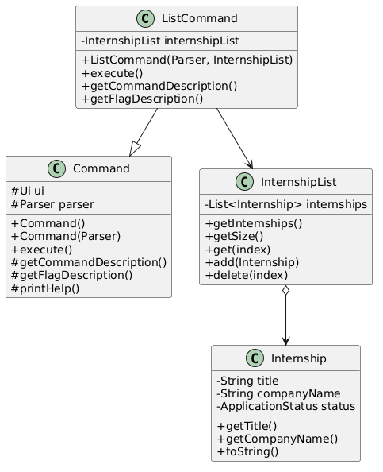

The following sequence diagram illustrates the execution flow when the user enters `list`:

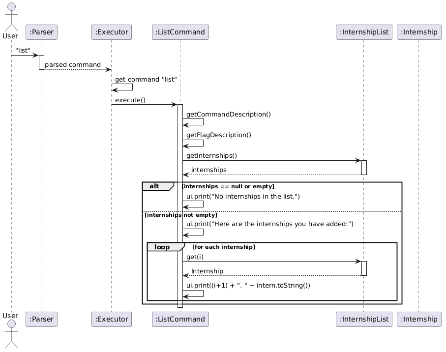

#### Input Validation

The command implements defensive checks to ensure robustness:

| Validation Layer | Description | Handling |
|-----------------|-------------|----------|
| **Null Check** | Verifies `internshipList` is not null | Throws `GoldenCompassException` if null |
| **List Null Check** | Verifies `getInternships()` does not return null | Throws `GoldenCompassException` if null |
| **Empty List Check** | Checks if the internship list is empty | Displays friendly message, returns early |

#### Defensive Programming Features

The implementation includes several defensive programming measures:

**1. Assertions**: Verify internal state invariants during command initialization.
assert this.internshipList != null : "InternshipList should be set";

**2. Logging**: Track execution flow and errors for debugging.
logger.info("Executing ListCommand");
logger.warning("Null internship found at index " + i);
logger.severe("Unexpected error in ListCommand: " + e.getMessage());

**3. Null Checks**: Prevent NullPointerException before accessing data.
if (internshipList == null) {
throw new GoldenCompassException("System error: Internship list not initialized");
}

**4. Defensive Loop**: Checks each internship item before printing.
if (intern == null) {
logger.warning("Null internship found at index " + i);
ui.print((i + 1) + ". [Error: Invalid internship data]");
} else {
ui.print((i + 1) + ". " + intern);
}

#### Design Considerations

**Aspect: Display Format**

- **Alternative 1 (current):** Display index, company name, and job title with status tags using `toString()`.
  - **Pros:** Simple, easy to read, shows all essential information including offer/rejection status.
  - **Cons:** Long names may cause wrapping in narrow terminals.

- **Alternative 2:** Display only company names.
  - **Pros:** More compact.
  - **Cons:** Users cannot see job titles without additional commands.

#### Test Coverage

The feature is covered by comprehensive unit tests in `InternshipListTest`:

| Test Case | Description | Expected Outcome |
|-----------|-------------|------------------|
| `list_emptyList_printsNoInternshipsMessage` | Execute `list` with no internships | Prints "No internships in the list" |
| `list_singleInternship_printsCorrectly` | Execute `list` with one internship | Shows header and single entry |
| `list_multipleInternships_printsAllCorrectly` | Execute `list` with multiple internships | Shows all entries with correct indices |
| `list_largeNumberOfInternships_printsAll` | Execute `list` with 10 internships | All 10 entries displayed correctly |
| `add_internship_increasesListSize` | Add internship after list | List size increases by 1 |
| `add_nullInternship_throwsException` | Attempt to add null internship | Throws `IllegalArgumentException` |
| `getInternship_invalidIndex_throwsException` | Access index out of bounds | Throws `IndexOutOfBoundsException` |

### Search Internship Command

#### Overview

The `search` command allows users to find internships by company name and/or job title using case-insensitive substring matching.

**Command format:** `search [/c COMPANY] [/t TITLE]`

**Examples:**
- `search /c Google` - Finds all internships with "Google" in the company name
- `search /t Engineer` - Finds all internships with "Engineer" in the title
- `search /c Google /t Software` - Finds internships matching both criteria

#### Implementation

The feature is implemented in `SearchInternshipCommand`, which extends the abstract `Command` class.

When the user enters `search /c Google`, the execution flow is as follows:

1. The `Parser` parses the user input, extracting the command word "search" and the flags `/c` and its value "Google".
2. The system looks up the corresponding command and executes `SearchInternshipCommand`.
3. The command checks for the `/help` flag and displays help if present.
4. `SearchInternshipCommand` retrieves the company parameter using `getParamsOf("/c")` and the title parameter using `getParamsOf("/t")`.
5. The command validates that at least one search criterion is provided.
6. The command filters the internship list using the `matches()` method in `Internship`, which performs case-insensitive substring matching.
7. The filtered results are collected and displayed with indices.
8. If no matches are found, a "No internships found" message is displayed.
9. The command logs the search results.

The filtering relies on the `matches()` method in `Internship`:
public boolean matches(String company, String title) {
if (company != null && !company.isEmpty()
&& !this.companyName.toLowerCase().contains(company.toLowerCase())) {
return false;
}
if (title != null && !title.isEmpty()
&& !this.title.toLowerCase().contains(title.toLowerCase())) {
return false;
}
return true;
}

The following class diagram shows the main components involved in the search command:

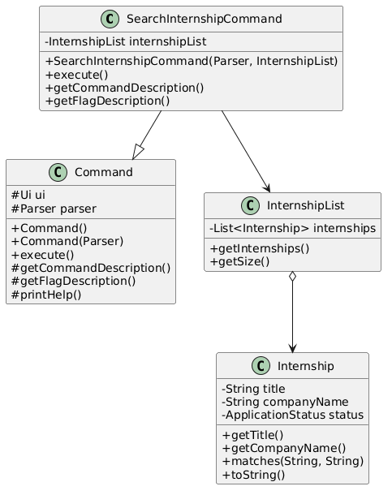

The following sequence diagram illustrates the execution flow when the user enters `search /c Google`:

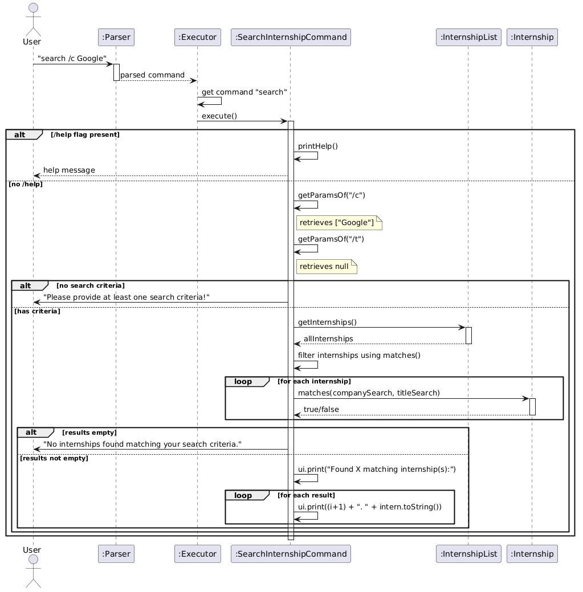

#### Input Validation

The command implements multiple layers of validation to ensure robustness:

| Validation Layer | Description | Example Error Message |
|-----------------|-------------|----------------------|
| **Criterion Presence** | Verifies at least one search flag is provided | "Please provide at least one search criteria!" |
| **Null Handling** | Handles null parameters gracefully | Treats null as "skip this criterion" |

#### Defensive Programming Features

The implementation includes several defensive programming measures:

**1. Assertions**: Verify internal state invariants during command initialization.
assert parser != null : "Parser cannot be null";
assert internshipList != null : "InternshipList cannot be null";

**2. Logging**: Track execution flow and search results.
logger.info("Executing SearchInternshipCommand");
logger.info("Search found " + results.size() + " results");

**3. Null Checks**: Handle null parameters from parser.
String companySearch = (companyParams != null && !companyParams.isEmpty())
? companyParams.get(0).trim() : null;

**4. Help Flag Support**: Display usage information when `/help` flag is provided.

#### Design Considerations

**Aspect: Matching Strategy**

- **Alternative 1 (current choice):** Case-insensitive substring matching.
  - **Pros:** User-friendly, catches partial matches (e.g., "Goo" matches "Google").
  - **Cons:** May return unexpected results with very short substrings.

- **Alternative 2:** Exact case-sensitive matching.
  - **Pros:** More precise.
  - **Cons:** Less forgiving for user typos or case differences.

**Aspect: Combined Search Logic**

- **Alternative 1 (current choice):** AND logic (matches both company AND title).
  - **Pros:** More specific results, narrows down search effectively.
  - **Cons:** May return no results if criteria are too strict.

- **Alternative 2:** OR logic (matches either company OR title).
  - **Pros:** Returns more results, broader search.
  - **Cons:** Less specific, may overwhelm users with irrelevant results.

**Aspect: Where to place filtering logic**

- **Alternative 1 (current choice):** Delegate filtering to `Internship.matches()`.
  - **Pros:** Encapsulates matching logic in the domain object, reusable.
  - **Cons:** The `Internship` class takes on matching responsibility.

- **Alternative 2:** Perform all filtering inline in the command class.
  - **Pros:** All logic in one place.
  - **Cons:** Harder to reuse the matching logic from other commands.

#### Test Coverage

The feature is covered by comprehensive unit tests in `SearchInternshipCommandTest`:

| Test Case | Description | Expected Outcome |
|-----------|-------------|------------------|
| `execute_searchByCompany_findsMatches` | Search by company name | Returns matching internships |
| `execute_searchByTitle_findsMatches` | Search by job title | Returns matching internships |
| `execute_searchByCompanyAndTitle_findsMatches` | Combined search with AND logic | Returns internships matching both |
| `execute_searchCaseInsensitive_findsMatches` | Case-insensitive search | Matches regardless of case |
| `execute_searchPartialMatch_findsMatches` | Partial substring matching | "Soft" matches "Software Engineer" |
| `execute_noMatches_printsNoResults` | No matching internships | Prints "No internships found" |
| `execute_emptyList_printsNoResults` | Empty internship list | Prints "No internships found" |
| `execute_noCriteria_throwsException` | No search flags provided | Throws `GoldenCompassException` |
| `execute_emptyCompanyCriteria_throwsException` | Empty company flag | Throws `GoldenCompassException` |
| `execute_emptyTitleCriteria_throwsException` | Empty title flag | Throws `GoldenCompassException` |
| `execute_searchWithExtraWhitespace_worksCorrectly` | Extra whitespace in input | Trims and works correctly |
| `execute_multipleInternshipsSameCompany_showsAll` | Multiple matches for same company | Shows all matching internships |

### Delete Internship Command

#### Overview

The `delete` command allows the user to remove an existing internship application from the tracker. When an internship is deleted, its associated interview is automatically removed to maintain data consistency.

**Command format:** `delete INDEX`

**Example:** `delete 2` removes the 2nd internship from the list.

#### Implementation

The delete feature is implemented in `DeleteInternshipCommand`, which extends the abstract `Command` class. The command is pre-registered in the `Executor`'s command lookup map during application initialization.

When the user enters `delete 2`, the execution flow is as follows:

1. The `Parser` parses the user input, extracting the command word "delete" and the argument "2".
2. The `Executor` retrieves the command word and looks up the corresponding `Command` instance from its internal `Map<String, Command>` using `commands.get("delete")`.
3. The `Executor` calls `execute()` on the retrieved `DeleteInternshipCommand` instance (no new command object is created).
4. `DeleteInternshipCommand` retrieves the index parameter from the `Parser` using `getParamsOf(parser.getCommand())`.
5. The command validates that the parameter is present, is a valid integer, and falls within the range `[1, internshipList.getSize()]`.
6. The command checks if the internship has an associated interview and deletes it first using `interviewList.deleteByInternship(internship)`.
7. The command calls `internshipList.delete(index - 1)` to permanently remove the internship.
8. The command logs the deletion with details of the removed internship.
9. The command prints a confirmation message to the user via the `Ui`.

**Note:** The `Executor` does not instantiate a new command for each execution. Instead, it uses a pre-registered command instance from the lookup map, following the Command Pattern.

The following class diagram shows the main components involved in the delete internship feature:


The following sequence diagram illustrates the execution flow when the user enters `delete 2`:


#### Input Validation

The command implements multiple layers of validation to ensure robustness:

| Validation Layer | Description | Example Error Message |
|-----------------|-------------|----------------------|
| **Presence Check** | Verifies that an index was provided | "Please provide the index of the internship to delete! (e.g., delete 1)" |
| **Type Check** | Ensures the index is a valid integer | "The index must be a number! (e.g., delete 1)" |
| **Range Check** | Confirms the index is within the list bounds | "Invalid index! Please enter a number between 1 and X" |

#### Defensive Programming Features

The implementation includes several defensive programming measures:

**1. Assertions**: Verify internal state invariants during command initialization.
assert parser != null : "Parser passed to DeleteInternshipCommand cannot be null";
assert internshipList != null : "InternshipList passed to DeleteInternshipCommand cannot be null";

**2. Logging**: Track execution flow and errors.
logger.log(Level.INFO, "Starting execution of DeleteInternshipCommand...");
logger.log(Level.WARNING, "Failed to delete: Index is missing.");
logger.info("Deleted associated interview for: " + internship.getCompanyName());

**3. Bounds Checking**: Validate array indices before access.
if (index < 0 || index >= internships.size()) {
throw new IndexOutOfBoundsException("Index: " + index);
}

**4. Null Checks**: Prevent NullPointerException.
if (internshipList == null) {
throw new IllegalArgumentException("InternshipList cannot be null");
}

**5. Graceful Exception Handling**: Catch parsing errors and provide user-friendly messages.
try {
index = Integer.parseInt(params.get(0).trim());
} catch (NumberFormatException e) {
throw new GoldenCompassException("The index must be a number!");
}

#### Design Considerations

**Aspect: Indexing Scheme**

- **Alternative 1 (current choice):** Use 1-based indexing for user input, convert to 0-based internally.
  - **Pros:** More intuitive for users who think of list positions starting from 1.
  - **Cons:** Requires conversion logic and careful handling.

- **Alternative 2:** Use 0-based indexing directly.
  - **Pros:** Matches internal representation, no conversion needed.
  - **Cons:** Less intuitive for users; first item is "0" not "1".

**Aspect: Deletion Strategy**

- **Alternative 1 (current choice):** Immediate permanent deletion with auto-delete of associated interview.
  - **Pros:** Maintains data consistency, prevents orphaned records, simple to implement.
  - **Cons:** No recovery option if user deletes accidentally.

- **Alternative 2:** Soft delete (mark as deleted but keep in storage).
  - **Pros:** Allows undo functionality, data can be recovered.
  - **Cons:** Adds complexity to data model and queries.

**Aspect: Error Handling Strategy**

- **Alternative 1 (current choice):** Fail-fast validation with specific error messages.
  - **Pros:** Clear immediate feedback to users.
  - **Cons:** May require multiple attempts if user makes multiple mistakes.

- **Alternative 2:** Accumulate all validation errors before throwing.
  - **Pros:** User sees all errors at once.
  - **Cons:** More complex error handling logic.

#### Test Coverage

The feature is covered by comprehensive unit tests in `DeleteInternshipCommandTest`:

| Test Case | Description | Expected Outcome |
|-----------|-------------|------------------|
| `delete_firstInternship_removesCorrectly` | Delete index 1 from list of 3 | List size decreases to 2, items shift left |
| `delete_middleInternship_removesCorrectly` | Delete index 2 from list of 3 | List size decreases to 2, items reorder correctly |
| `delete_lastInternship_removesCorrectly` | Delete index 3 from list of 3 | List size decreases to 2, last item removed |
| `delete_indexOutOfBounds_throwsException` | Delete index larger than list size | Throws `IndexOutOfBoundsException` |
| `delete_emptyList_throwsException` | Delete from empty list | Throws `IndexOutOfBoundsException` |
| `delete_withAssociatedInterview_removesBoth` | Delete internship with existing interview | Both internship and interview are removed |
| `delete_negativeIndex_throwsException` | Delete with negative index | Throws `GoldenCompassException` |
| `delete_nonNumericIndex_throwsException` | Delete with non-numeric input | Throws `GoldenCompassException` |
| `delete_missingIndex_throwsException` | Delete without index | Throws `GoldenCompassException` |


### Interview Management — Class Overview

The following class diagram shows the key classes involved in interview management and their relationships.


Each `Interview` holds a reference to the `Internship` it is associated with.
`AddInterviewCommand` bridges the two lists — it reads from `InternshipList` and writes to `InterviewList`.
`SetInterviewDeadlineCommand` only needs access to `InterviewList` since it modifies an existing interview.

### Add Interview Feature

#### Overview

The `add-interview` command allows the user to create an interview linked to an existing internship.
The user specifies the 1-based index of the internship and a date-time, and the system creates an
`Interview` object referencing that `Internship` and adds it to the `InterviewList`.

**Command format:** `add-interview INDEX /d DATE`

**Example:** `add-interview 2 /d 2025-06-15 10:00` creates an interview on 15 Jun 2025 at 10:00
for the 2nd internship in the list.

#### Implementation

The feature is implemented in `AddInterviewCommand`, which extends `Command`.
When `execute()` is called, it performs the following steps:

1. Retrieves the index parameter from the `Parser` using `getParamsOf(parser.getCommand())`.
2. Retrieves the date parameter from the `Parser` using `getParamsOf("/d")`.
3. Validates that both parameters are present and non-empty.
4. Parses the index as an integer and checks it is within the range `[1, internshipList.getSize()]`.
5. Parses the date string into a `LocalDateTime` using the format `yyyy-MM-dd HH:mm`.
6. Validates the date is not in the past.
7. Retrieves the `Internship` at the 0-based position `(index - 1)` from `InternshipList`.
8. Checks the internship does not already have an interview (prevents duplicates).
9. Creates a new `Interview` object linked to that `Internship` with the given date-time.
10. Sets the interview reference on the `Internship` and adds the `Interview` to the `InterviewList`.
11. Prints a confirmation message to the user.

The following sequence diagram illustrates the execution flow when the user enters
`add-interview 2 /d 2025-06-15 10:00`:


#### Input Validation

The command implements multiple layers of validation to ensure robustness:

| Validation Layer | Description | Example Error Message |
|-----------------|-------------|----------------------|
| **Index Presence** | Verifies the index parameter is present | "Please provide the index of the internship." |
| **Date Presence** | Verifies the `/d` flag and value are present | "Please provide a date using the /d flag." |
| **Type Check** | Ensures the index is a valid integer | "Index must be a valid integer, got: abc" |
| **Range Check** | Confirms index is within list bounds | "Index 99 is out of range. There are 2 internship(s)." |
| **Date Format** | Validates the date string parses correctly | "Invalid date format, expected yyyy-MM-dd HH:mm" |
| **Date-in-Past** | Rejects dates earlier than the current time | "Interview date ... is in the past." |
| **Duplicate Check** | Prevents adding a second interview to an internship | "... already has an interview scheduled." |

#### Defensive Programming Features

**1. Assertions**: Verify internal state invariants during execution.
```java
assert parser != null : "Parser should not be null";
assert internshipList != null : "InternshipList should not be null";
```

**2. Logging**: Track execution flow and specific validation failures.
```java
logger.log(Level.WARNING, "Failed to add interview: date is in the past.");
logger.log(Level.WARNING, "Failed to add interview: internship already has an interview.");
```

#### Design Considerations

**Aspect: How to link an Interview to an Internship**

- **Alternative 1 (current choice):** Store a reference to the `Internship` object inside `Interview`.
    - Pros: Simple, direct access to internship details (e.g., company name, title) without extra lookups.
    - Cons: If the `Internship` object is modified or removed, the `Interview` still holds the old reference.

- **Alternative 2:** Store only the internship index and look it up when needed.
    - Pros: Always reads the latest internship data.
    - Cons: Fragile if the internship list is reordered or items are deleted, since the stored index may become invalid.

**Aspect: Date-time format**

- **Alternative 1 (current choice):** Use `yyyy-MM-dd HH:mm` format with `LocalDateTime`.
    - Pros: Includes both date and time, giving users precise scheduling control.
    - Cons: Longer input required from the user.

- **Alternative 2:** Use `yyyy-MM-dd` format with `LocalDate` (date only).
    - Pros: Shorter input.
    - Cons: Cannot differentiate between interviews on the same day at different times.

**Aspect: Duplicate interview handling**

- **Alternative 1 (current choice):** Reject the command if the internship already has an interview.
    - Pros: Prevents accidental data loss. User is told to use `update-date` or `delete-interview` first.
    - Cons: Requires an extra step if the user wants to replace the interview.

- **Alternative 2:** Silently overwrite the existing interview.
    - Pros: Fewer steps for the user.
    - Cons: User may accidentally lose an existing interview without realising.

#### Test Coverage

| Test Case | Description | Expected Outcome |
|-----------|-------------|------------------|
| `execute_validIndex_addsInterviewSuccessfully` | Add interview with valid index and future date | Interview added, list size increases by 1 |
| `execute_validIndexSecondInternship_addsInterviewSuccessfully` | Add to 2nd internship | Interview added successfully |
| `execute_nonIntegerIndex_exceptionThrown` | Use `abc` as index | Throws `GoldenCompassException` |
| `execute_indexOutOfRangeHigh_exceptionThrown` | Use index `99` for list of 2 | Throws `GoldenCompassException` |
| `execute_indexOutOfRangeZero_exceptionThrown` | Use index `0` | Throws `GoldenCompassException` |
| `execute_negativeIndex_exceptionThrown` | Use index `-1` | Throws `GoldenCompassException` |
| `execute_missingIndex_exceptionThrown` | Omit index entirely | Throws `GoldenCompassException` |

### Update Interview Date Feature

#### Overview

The `update-date` command allows the user to set or update the date and time of an existing interview.
The user specifies the 1-based index of the interview (as shown by `list-interview`, sorted by date)
and a date-time in `yyyy-MM-dd HH:mm` format.

**Command format:** `update-date INDEX /d DATE`

**Example:** `update-date 1 /d 2025-04-15 14:00` sets the date of the 1st interview to
April 15, 2025 at 14:00.

#### Implementation

The feature is implemented in `SetInterviewDeadlineCommand`, which extends `Command`.
When `execute()` is called, it performs the following steps:

1. Retrieves the index parameter from the `Parser` using `getParamsOf(parser.getCommand())`.
2. Retrieves the date parameter from the `Parser` using `getParamsOf("/d")`.
3. Validates that both parameters are present and non-empty.
4. Parses the index as an integer and checks it is within valid range using `interviewList.isValidIndex()`.
5. Parses the date string into a `LocalDateTime` using the format `yyyy-MM-dd HH:mm`.
6. Sorts the interview list by date and retrieves the `Interview` at the 0-based position `(index - 1)`.
7. Calls `interview.setDate(date)` to update the date-time.
8. Prints a confirmation message to the user.

The following sequence diagram illustrates the execution flow when the user enters
`update-date 1 /d 2025-04-15 14:00`:


#### Input Validation

| Validation Layer | Description | Example Error Message |
|-----------------|-------------|----------------------|
| **Index Presence** | Verifies the index parameter is present | "Please provide the index of the interview." |
| **Date Presence** | Verifies the `/d` flag and value are present | "Please provide a date using the /d flag." |
| **Type Check** | Ensures the index is a valid integer | "Index must be a valid integer, got: abc" |
| **Range Check** | Confirms index is within interview list bounds | "Index 99 is out of range. There are 1 interview(s)." |
| **Date Format** | Validates the date string parses correctly | "Invalid date format, expected yyyy-MM-dd HH:mm" |

#### Defensive Programming Features

**1. Assertions**: Verify internal state invariants during execution.
```java
assert parser != null : "Parser should not be null";
assert interviewList != null : "InterviewList should not be null";
```

**2. Logging**: Track execution flow and specific validation failures.
```java
logger.log(Level.WARNING, "Failed to update date: index is not a number.");
logger.log(Level.INFO, "Successfully updated interview " + index + " to " + date);
```

#### Design Considerations

**Aspect: How to identify which interview to update**

- **Alternative 1 (current choice):** Use a 1-based index from the displayed interview list (sorted by date).
    - Pros: Consistent with other commands. Simple for the user to type.
    - Cons: The user must run `list-interview` first to know the index.

- **Alternative 2:** Identify by internship name or interview description.
    - Pros: More intuitive — the user does not need to memorise or look up an index.
    - Cons: Ambiguous if multiple interviews share the same internship name. Requires more complex matching logic.

**Aspect: How to accept the date input**

- **Alternative 1 (current choice):** Use a `/d` flag to separate the date from the index parameter.
    - Pros: Consistent with the existing flag-based command framework. Clear separation of arguments.
    - Cons: Slightly more verbose for the user.

- **Alternative 2:** Accept the date as a positional argument (e.g., `update-date 1 2025-04-15 14:00`).
    - Pros: Shorter command for the user.
    - Cons: Breaks the flag-based convention used by other commands, making the parser inconsistent.

#### Test Coverage

| Test Case | Description | Expected Outcome |
|-----------|-------------|------------------|
| `execute_validIndexAndDate_setsDeadlineSuccessfully` | Update with valid index and date | Date updated to new value |
| `execute_nonIntegerIndex_exceptionThrown` | Use `abc` as index | Throws `GoldenCompassException` |
| `execute_indexOutOfRangeHigh_exceptionThrown` | Use index `99` for list of 1 | Throws `GoldenCompassException` |
| `execute_indexOutOfRangeZero_exceptionThrown` | Use index `0` | Throws `GoldenCompassException` |
| `execute_invalidDateFormat_exceptionThrown` | Use `2028` as date | Throws `GoldenCompassException` |
| `execute_missingDateFlag_exceptionThrown` | Omit `/d` flag | Throws `GoldenCompassException` |
| `execute_wrongFlag_exceptionThrown` | Use `/by` instead of `/d` | Throws `GoldenCompassException` |
| `execute_missingIndex_exceptionThrown` | Omit index entirely | Throws `GoldenCompassException` |

### Search Interview Feature

#### Overview

The `search-interview` command allows the user to search for interviews by company name, role,
and/or date. Multiple flags narrow the results using AND logic. Text matching is case-insensitive
substring matching, while date matching is an exact match on the date portion.

**Command format:** `search-interview [/c COMPANY] [/t ROLE] [/d DATE]`

**Example:** `search-interview /c Google /d 2025-06-15` finds all interviews at companies
containing "Google" on 15 Jun 2025.

#### Implementation

The feature is implemented in `SearchInterviewCommand`, which extends `Command`.
When `execute()` is called, it performs the following steps:

1. Retrieves the optional parameters for `/c`, `/t`, and `/d` from the `Parser`.
2. Extracts each keyword using a helper method `getKeyword()`, treating blank or missing values as `null`.
3. Validates that at least one search flag is provided.
4. If a `/d` value is provided, parses it into a `LocalDate` (format `yyyy-MM-dd`).
5. Filters the interview list using Java streams with `Interview.matches(company, title, date)`,
   which applies AND logic across all non-null criteria.
6. Prints the matching results with numbered indices, or a "no results" message if none match.

The filtering relies on the `matches()` method in `Interview`, which uses direct field access
to `internship.companyName` and `internship.title` for case-insensitive substring matching,
and compares dates via `dateTime.toLocalDate().equals(date)`.

The following sequence diagram illustrates the execution flow when the user enters
`search-interview /c Google`:


#### Input Validation

| Validation Layer | Description | Example Error Message |
|-----------------|-------------|----------------------|
| **Flag Presence** | At least one of `/c`, `/t`, `/d` must be provided | "Please provide at least one search flag." |
| **Date Format** | If `/d` is provided, validates it as `yyyy-MM-dd` | "Invalid date format, expected yyyy-MM-dd" |

#### Defensive Programming Features

**1. Assertions**: Verify internal state invariants during execution.
```java
assert parser != null : "Parser should not be null";
assert interviewList != null : "InterviewList should not be null";
```

**2. Logging**: Track search criteria and result count for debugging.
```java
logger.log(Level.INFO, "Searching interviews with company=" + companyKeyword
        + ", title=" + titleKeyword + ", date=" + date);
logger.log(Level.INFO, "Search found " + results.size() + " result(s).");
```

#### Design Considerations

**Aspect: Single filter vs. combined filters**

- **Alternative 1 (current choice):** Support multiple optional flags with AND logic.
    - Pros: Flexible — users can narrow results progressively. One command handles all search needs.
    - Cons: Slightly more complex parsing and validation logic.

- **Alternative 2:** Separate commands for each search type (e.g., `search-by-company`, `search-by-date`).
    - Pros: Each command is simpler.
    - Cons: More commands to learn. Cannot combine filters without chaining commands.

**Aspect: Where to place the filtering logic**

- **Alternative 1 (current choice):** Delegate filtering to `Interview.matches()`.
    - Pros: Encapsulates matching logic in the domain object. The command class stays clean
      and focused on orchestration.
    - Cons: The `Interview` class takes on matching responsibility.

- **Alternative 2:** Perform all filtering inline in the command class.
    - Pros: All logic in one place.
    - Cons: Harder to reuse the matching logic from other commands.

#### Test Coverage

| Test Case | Description | Expected Outcome |
|-----------|-------------|------------------|
| `execute_searchByCompany_findsMatches` | Search `/c Google` with 2 Google interviews | Finds both matches |
| `execute_searchByCompanyCaseInsensitive_findsMatches` | Search `/c google` (lowercase) | Matches case-insensitively |
| `execute_searchByTitle_findsMatches` | Search `/t Engineer` | Finds interviews with "Engineer" in role |
| `execute_searchByDate_findsMatches` | Search `/d 2028-07-20` | Finds interviews on that date |
| `execute_searchByCompanyAndTitle_findsMatches` | Combined `/c Google /t Product` | Matches both criteria (AND) |
| `execute_searchByCompanyAndDate_findsMatches` | Combined `/c Google /d 2028-06-15` | Matches both criteria |
| `execute_noMatchingResults_printsNoResults` | Search `/c Amazon` with no Amazon interviews | Prints "No interviews found" |
| `execute_noFlagsProvided_exceptionThrown` | Omit all flags | Throws `GoldenCompassException` |
| `execute_invalidDateFormat_exceptionThrown` | Use `not-a-date` for `/d` | Throws `GoldenCompassException` |
| `execute_emptyList_printsNoResults` | Search on empty interview list | Prints "No interviews found" |

### Clear Rejected Feature

#### Overview

The `clear-rejected` command removes all internships that have been marked as rejected from the
tracker, along with their associated interviews. This helps users declutter their list by
removing entries they no longer need to track, while preventing orphaned interview records.

**Command format:** `clear-rejected`

**Example:** `clear-rejected` removes all rejected internships and prints a summary of what was removed.

#### Implementation

The feature is implemented in `ClearRejectedCommand`, which extends `Command`.
When `execute()` is called, it performs the following steps:

1. Retrieves the full internship list from `InternshipList`.
2. Filters the list using Java streams to find all internships where `isRejected()` returns `true`.
3. If no rejected internships are found, prints a message and returns.
4. For each rejected internship that has an associated interview, deletes the interview
   from `InterviewList` using `deleteByInternship()`.
5. Removes all rejected internships from the list using `removeAll()`.
6. Prints a summary showing how many were cleared and their details.

The following sequence diagram illustrates the execution flow when the user enters
`clear-rejected`:

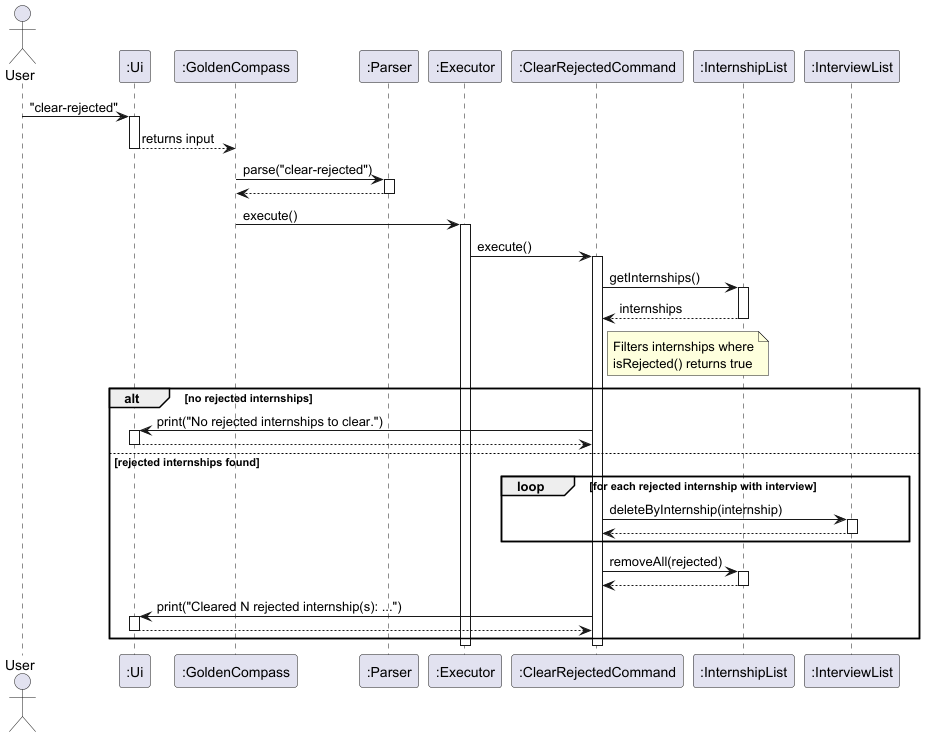

#### Defensive Programming Features

**1. Assertions**: Verify internal state invariants during execution.
```java
assert internshipList != null : "InternshipList should not be null";
assert interviewList != null : "InterviewList should not be null";
```

**2. Logging**: Track the number of entries cleared and interview deletions.
```java
logger.log(Level.INFO, "Found " + rejected.size() + " rejected internship(s) to clear.");
logger.log(Level.INFO, "Deleted associated interview for: " + internship.getCompanyName());
```

#### Design Considerations

**Aspect: Clearing strategy**

- **Alternative 1 (current choice):** Remove all rejected internships at once.
    - Pros: Simple one-step cleanup. No need for the user to identify individual entries.
    - Cons: No selective removal — it is all-or-nothing.

- **Alternative 2:** Allow the user to specify which rejected internships to clear.
    - Pros: More granular control.
    - Cons: Adds unnecessary complexity — if the user wants to keep a rejected entry,
      they likely would not have rejected it in the first place.

**Aspect: Handling associated interviews**

- **Alternative 1 (current choice):** Automatically delete associated interviews when clearing rejected internships.
    - Pros: Prevents orphaned interview records. Maintains data consistency without user intervention.
    - Cons: User cannot keep the interview while removing the internship (unlikely use case).

- **Alternative 2:** Only delete the internship, leave interviews.
    - Pros: Simpler implementation.
    - Cons: Orphaned interviews with no parent internship cause confusion and potential errors.

#### Test Coverage

| Test Case | Description | Expected Outcome |
|-----------|-------------|------------------|
| `execute_noRejected_printsNoRejected` | Clear with no rejected entries | List unchanged, message printed |
| `execute_allRejected_clearsAll` | All internships are rejected | List becomes empty |
| `execute_someRejected_clearsOnlyRejected` | Mix of rejected and non-rejected | Only rejected entries removed |
| `execute_emptyList_printsNoRejected` | Clear on empty list | No error, message printed |

### List upcoming interviews

#### Overview

The user can list upcoming interviews within a specific number of days.

**Command format:** `upcoming [N]`, where `N` is an integer.

This lists all upcoming interviews within the following `N` days. If the optional parameter `[N]` is omitted, a default 
of `5` days will be used. That is, `upcoming` will list all upcoming interviews within the subsequent `5` days.

Note: negative `N` is allowed but will always output `You don't have any upcoming interviews.`
#### Implementation

The feature is implemented in `UpcomingCommand`, the relationship of which to other classes is shown in the following class diagram 

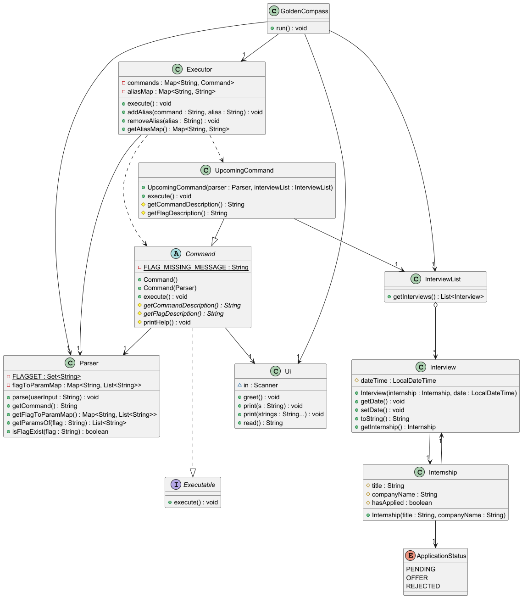

The following sequence diagram illustrates a call to `execute()` of `UpcomingCommand`

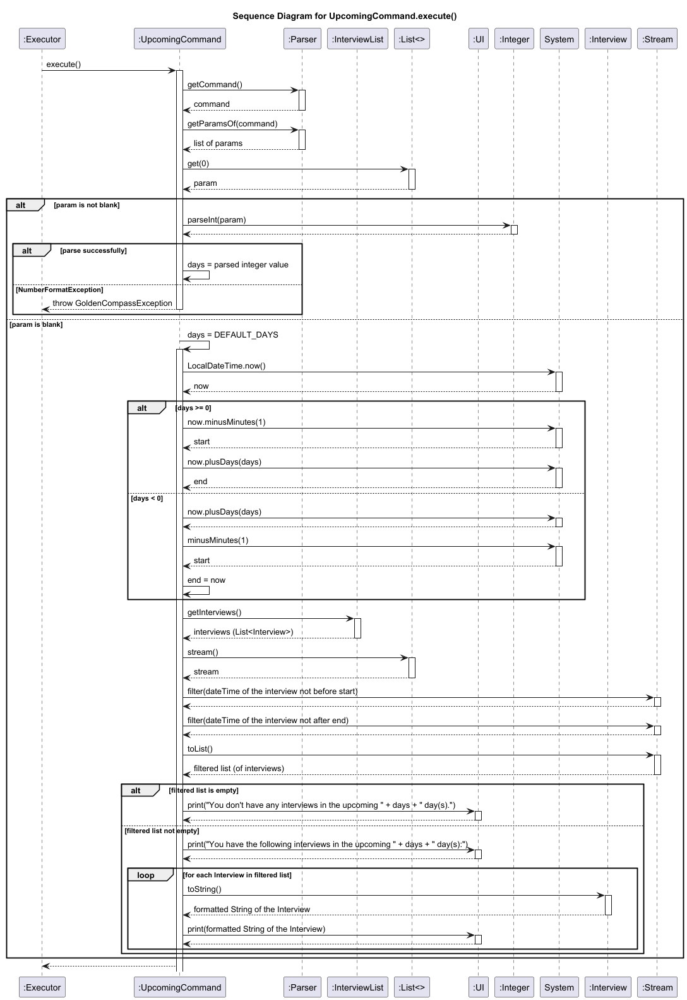

### Delete Interview Command

#### Overview

The `delete-interview` command removes an interview from an internship while preserving the internship record.

**Command format:** `delete-interview INDEX`

**Example:** `delete-interview 1` removes the interview from the 1st internship in the list.

#### Implementation

The feature is implemented in `DeleteInterviewCommand`, which extends the abstract `Command` class.

When the user enters `delete-interview 1`, the execution flow is as follows:

1. The `Parser` parses the user input, extracting the command word "delete-interview" and the argument "1".
2. The system looks up the corresponding command and executes `DeleteInterviewCommand`.
3. `DeleteInterviewCommand` retrieves the index parameter from the `Parser` using `getParamsOf(parser.getCommand())`.
4. The command validates that the parameter is present, is a valid integer, and falls within the range `[1, internshipList.getSize()]`.
5. The command retrieves the `Internship` at the 0-based position `(index - 1)` from `InternshipList`.
6. The command searches the `InterviewList` for an interview belonging to this internship by comparing company names.
7. If no interview is found, an exception is thrown.
8. If found, the interview is removed from `InterviewList` and the internship's interview reference is cleared using `internship.deleteInterview()`.
9. The command prints a confirmation message to the user via the `Ui`.

The following class diagram shows the main components involved in the delete interview feature:

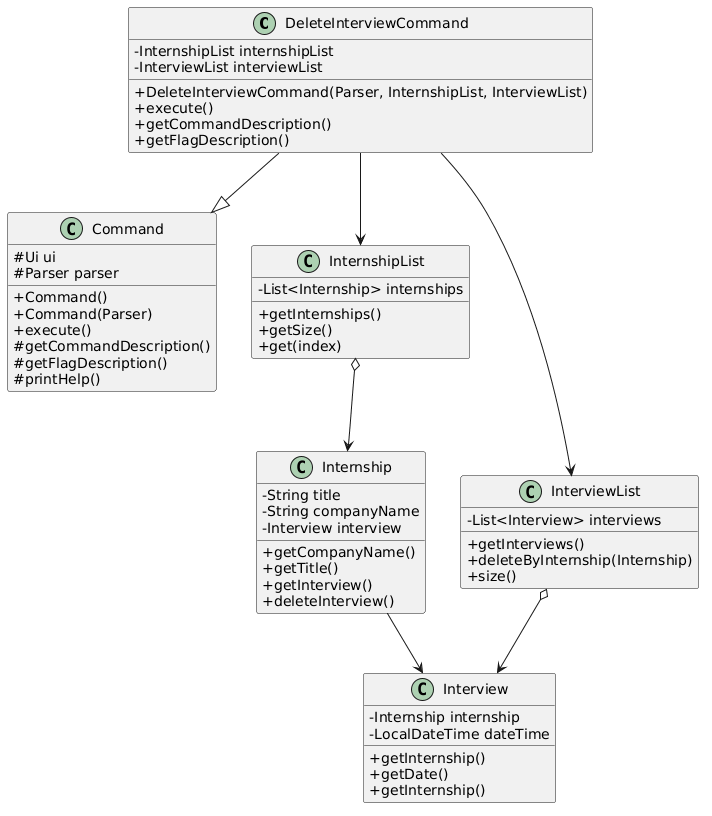

The following sequence diagram illustrates the execution flow when the user enters `delete-interview 1`:

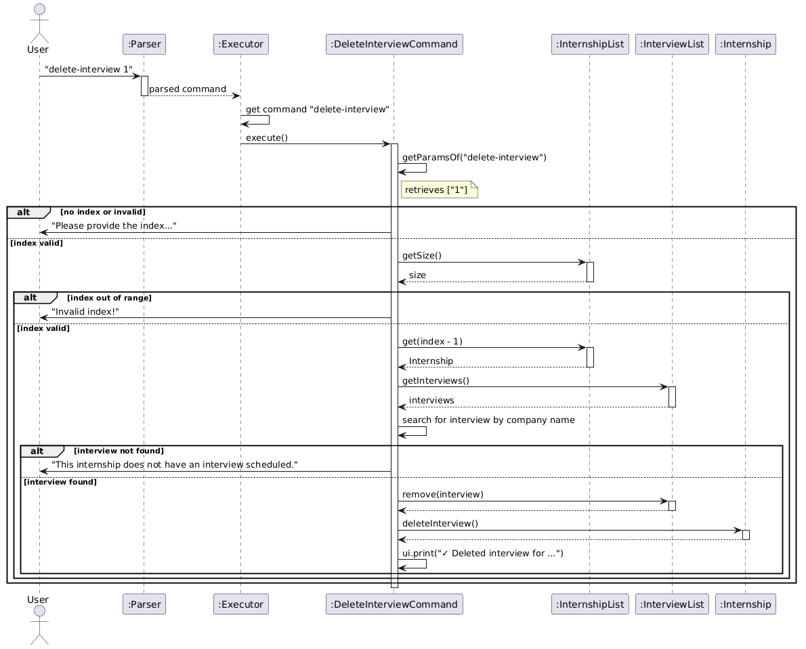

#### Input Validation

The command implements multiple layers of validation to ensure robustness:

| Validation Layer | Description | Example Error Message |
|-----------------|-------------|----------------------|
| **Presence Check** | Verifies that an index was provided | "Please provide the index of the internship to delete interview from!" |
| **Type Check** | Ensures the index is a valid integer | "The index must be a number!" |
| **Range Check** | Confirms the index is within the list bounds | "Invalid index! Please enter a number between 1 and X" |
| **Interview Existence** | Checks if the internship actually has an interview | "This internship does not have an interview scheduled." |

#### Defensive Programming Features

The implementation includes several defensive programming measures:

**1. Assertions**: Verify internal state invariants during command initialization.
assert parser != null : "Parser cannot be null";
assert internshipList != null : "InternshipList cannot be null";
assert interviewList != null : "InterviewList cannot be null";

**2. Logging**: Track execution flow and errors.
logger.info("Executing DeleteInterviewCommand");
logger.warning("Invalid index: " + index);
logger.info("Deleted interview for: " + internship.getCompanyName());

**3. Null Checks**: Prevent NullPointerException when accessing data.
if (params == null || params.isEmpty() || params.get(0).trim().isEmpty()) {
throw new GoldenCompassException("Please provide the index...");
}

**4. Graceful Exception Handling**: Provide clear error messages for user mistakes.

#### Design Considerations

**Aspect: Finding the Interview to Delete**

- **Alternative 1 (current choice):** Search by company name in InterviewList.
  - **Pros:** Works even if bidirectional link is broken.
  - **Cons:** Slightly slower for large lists (O(n) search).

- **Alternative 2:** Use `internship.getInterview()` reference.
  - **Pros:** Faster, direct access (O(1)).
  - **Cons:** Requires bidirectional link to be maintained.

**Aspect: What happens to the internship**

- **Alternative 1 (current choice):** Only the interview is deleted; internship remains.
  - **Pros:** Preserves application history, user can add another interview later.
  - **Cons:** None significant.

- **Alternative 2:** Delete both internship and interview.
  - **Pros:** Simpler.
  - **Cons:** User loses the entire application record.

#### Test Coverage

The feature is covered by comprehensive unit tests in `DeleteInterviewCommandTest`:

| Test Case | Description | Expected Outcome |
|-----------|-------------|------------------|
| `execute_validIndex_deletesInterviewSuccessfully` | Delete interview from valid internship | Interview removed, internship remains |
| `execute_invalidIndexOutOfBounds_throwsException` | Delete with index too high | Throws `GoldenCompassException` |
| `execute_negativeIndex_throwsException` | Delete with negative index | Throws `GoldenCompassException` |
| `execute_nonIntegerIndex_throwsException` | Delete with non-numeric input | Throws `GoldenCompassException` |
| `execute_missingIndex_throwsException` | Delete without index | Throws `GoldenCompassException` |
| `execute_noInterviewForInternship_throwsException` | Delete from internship with no interview | Throws `GoldenCompassException` |
| `execute_emptyInternshipList_throwsException` | Delete from empty list | Throws `GoldenCompassException` |
| `execute_multipleInternships_deletesCorrectInterview` | Delete interview from correct internship among multiple | Only target interview removed |

### Mark Offer Feature

#### Overview

The `mark` command allows the user to update the status of an existing internship application to indicate that an offer has been received. The user specifies the 1-based index of the internship in the current list, and the system updates its status to `OFFER` and immediately saves the change to the disk.

**Command format:** `mark INDEX` (or `mark-offer INDEX`)

**Example:** `mark 1` marks the 1st internship in the current list as having received an offer.

#### Implementation

The feature is implemented in `MarkOfferCommand`, which extends the abstract `Command` class.

When the user enters `mark 1`, the execution flow is as follows:

1. The `Parser` parses the user input, extracting the command word and the argument "1".
2. The system looks up the corresponding command and executes `MarkOfferCommand`.
3. `MarkOfferCommand` retrieves the index parameter from the `Parser` using `getParamsOf(parser.getCommand())`.
4. The command validates that the parameter is present, is a valid integer, and falls within the valid bounds of the `InternshipList` (between 1 and `internshipList.getSize()`).
5. The command retrieves the `Internship` at the 0-based position `(index - 1)` from the `InternshipList`.
6. The command calls `internship.markAsOffer()` to update the internal state and UI tag of the internship.
7. The command immediately calls `storage.save(internshipList)` to persist the updated status to `data/internships.txt`.
8. The command logs the successful update and prints a congratulatory confirmation message to the user via the `Ui`.

The following class diagram shows the main structural components involved in the mark offer feature:

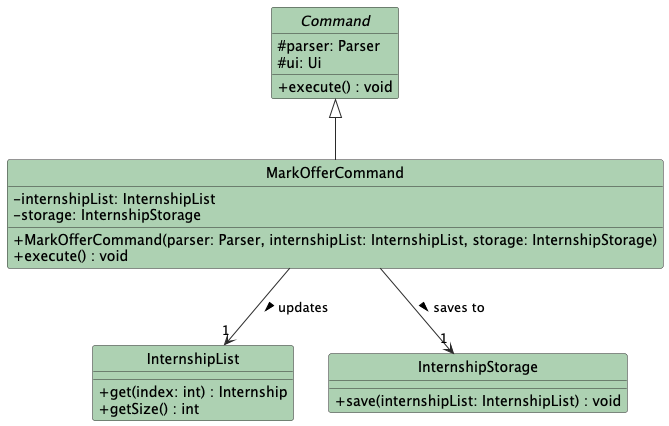

The following sequence diagram illustrates the execution flow when the user enters `mark 1`:

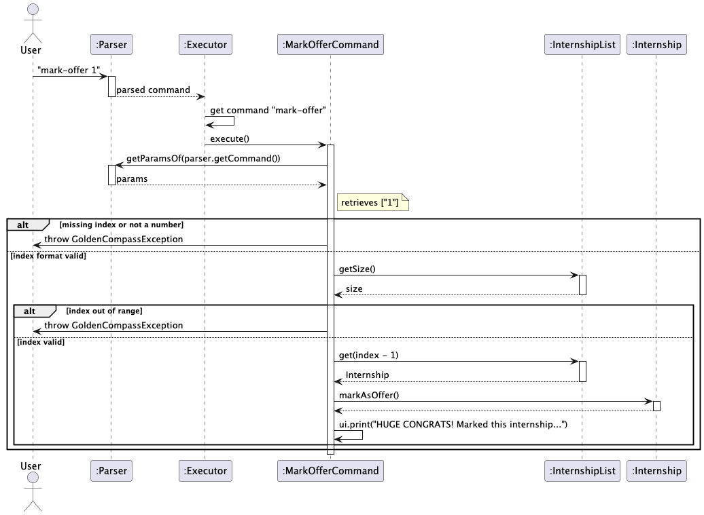

#### Input Validation

The command implements multiple layers of validation to ensure robustness:

| Validation Layer | Description | Example Error Message |
|-----------------|-------------|----------------------|
| **Presence Check** | Verifies that an index was provided | "Please provide the index of the internship! (e.g., mark 1)" |
| **Type Check** | Ensures the index is a valid integer | "The index must be a number! (e.g., mark 1)" |
| **Range Check** | Confirms the index is within the list bounds | "Invalid index! Please check your internship list." |

#### Defensive Programming Features

The implementation includes several defensive programming measures:

**1. Assertions**: Verify internal state invariants during command initialization.
assert parser != null : "Parser passed to MarkOfferCommand cannot be null";
assert internshipList != null : "InternshipList passed to MarkOfferCommand cannot be null";

**2. Logging**: Track execution flow and potential user input errors for debugging.
logger.log(Level.INFO, "Starting execution of MarkOfferCommand...");
logger.log(Level.WARNING, "Failed to mark offer: Index out of bounds.");

**3. Bounds Checking**: Validate array indices strictly before attempting access to prevent runtime crashes.
if (index < 1 || index > internshipList.getSize()) {
throw new GoldenCompassException("Invalid index!...");
}

**4. Graceful Exception Handling**: Catch specific parsing errors and translate them into user-friendly messages rather than letting the application crash.
try {
index = Integer.parseInt(params.get(0).trim());
} catch (NumberFormatException e) {
throw new GoldenCompassException("The index must be a number!...");
}

#### Design Considerations

**Aspect: Data Persistence Strategy for State Changes**

* **Alternative 1 (Current Implementation): Immediate Disk Write (Eager Saving)**
  * **Description:** The command takes in the `InternshipStorage` object as a dependency and immediately calls `storage.save()` right after changing the internship's status in memory.
  * **Pros:** Guarantees data safety. If the user unexpectedly closes the terminal, forces a quit, or the application crashes, the status change is already safely written to the text file.
  * **Cons:** Slightly couples the command to the storage mechanism and incurs a minor performance hit due to disk I/O operations occurring on every single status update.

* **Alternative 2: Deferred Disk Write (Save on Exit)**
  * **Description:** The command only updates the status of the `Internship` object in the RAM (`InternshipList`). Writing to the disk is deferred until the user explicitly exits the application.
  * **Pros:** Faster execution time and decouples the command classes from the storage mechanism.
  * **Cons:** High risk of data loss. If the application crashes before exiting cleanly, the recorded offer status is permanently lost.

**Aspect: Input Validation Strategy**

* **Alternative 1 (Current Implementation): Step-by-Step Fail-Fast Validation**
  * **Description:** The command independently checks for missing input, invalid formats, and out-of-bounds indices in sequence, throwing specific exceptions immediately.
  * **Pros:** Excellent UX. The user receives precise, actionable feedback about exactly what part of their input was wrong.
  * **Cons:** Slightly more verbose code within the `execute()` method.

* **Alternative 2: Blanket Try-Catch Block**
  * **Description:** The command attempts to parse and access the list directly, wrapping the logic in a single generic `try-catch` block.
  * **Pros:** More compact code.
  * **Cons:** Poor UX, as the user receives a generic "Invalid input" error regardless of the specific mistake made.

#### Test Coverage

The feature is covered by comprehensive unit tests to ensure all edge cases are handled:

| Test Case | Description | Expected Outcome |
|-----------|-------------|------------------|
| `execute_validIndex_marksOfferAndSaves` | Mark index 1 in a populated list | Internship status updates to OFFER, storage saves successfully |
| `execute_missingIndex_throwsException` | Execute `mark` with no arguments | Throws `GoldenCompassException` for missing index |
| `execute_nonNumericIndex_throwsException` | Execute `mark abc` | Throws `GoldenCompassException` for invalid number format |
| `execute_indexOutOfBounds_throwsException` | Execute `mark 99` on a small list | Throws `GoldenCompassException` for invalid bounds |
| `execute_negativeIndex_throwsException` | Execute `mark -1` | Throws `GoldenCompassException` for invalid bounds |


### Reject Offer Feature

#### Overview

The `reject` command allows the user to update the status of an existing internship application to indicate that the application has been rejected. The user specifies the 1-based index of the internship in the current list, and the system updates its status to `REJECTED`.

**Command format:** `reject INDEX`

**Example:** `reject 1` marks the 1st internship in the current list as rejected.

#### Implementation

The feature is implemented in `RejectOfferCommand`, which extends the abstract `Command` class.

When the user enters `reject 1`, the execution flow is as follows:

1. The `Parser` parses the user input, extracting the command word and the argument "1".
2. The system looks up the corresponding command and executes `RejectOfferCommand`.
3. `RejectOfferCommand` retrieves the index parameter from the `Parser` using `getParamsOf("reject")`.
4. The command validates that the parameter is present, is a valid integer, and falls within the valid bounds of the `InternshipList` (between 1 and `internshipList.getSize()`).
5. The command retrieves the `Internship` at the 0-based position `(index - 1)` from the `InternshipList`.
6. The command calls `internship.markAsRejected()` to update the internal state and UI tag of the internship.
7. The command logs the successful update and prints a confirmation message ("Rejection builds character! 💪") to the user via the inherited `ui` object.

The following class diagram shows the main structural components involved in the reject offer feature:

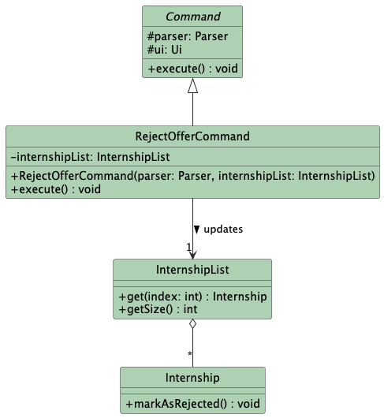

The following sequence diagram illustrates the execution flow when the user enters `reject 1`:

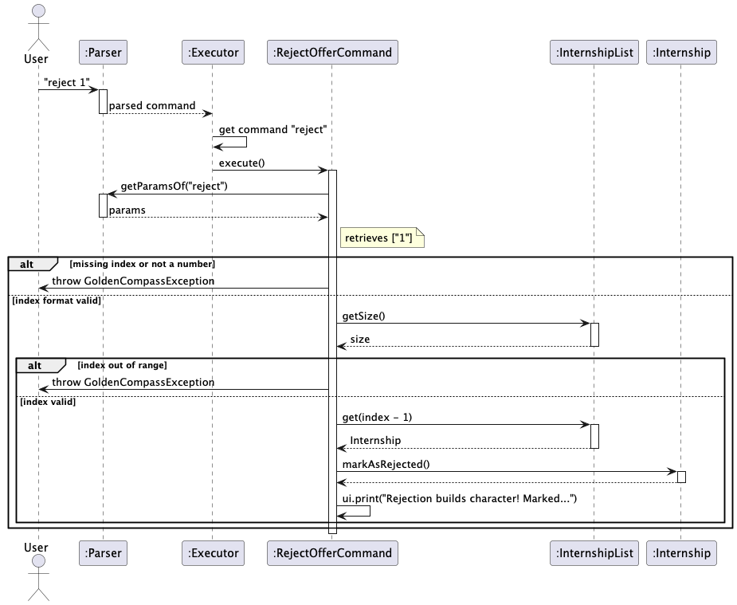

#### Input Validation

The command implements multiple layers of validation to ensure robustness:

| Validation Layer | Description | Example Error Message |
|-----------------|-------------|----------------------|
| **Presence Check** | Verifies that an index was provided | "Please provide the index of the internship! (e.g., reject 1)" |
| **Type Check** | Ensures the index is a valid integer | "The index must be a number! (e.g., reject 1)" |
| **Range Check** | Confirms the index is within the list bounds | "Invalid index! Please check your internship list." |

#### Defensive Programming Features

The implementation includes several defensive programming measures:

**1. Assertions**: Verify internal state invariants during command initialization.
assert parser != null : "Parser passed to RejectCommand cannot be null";
assert internshipList != null : "InternshipList passed to RejectCommand cannot be null";

**2. Logging**: Track execution flow and potential user input errors for debugging.
logger.log(Level.INFO, "Starting execution of RejectCommand...");
logger.log(Level.WARNING, "Failed to reject: Index is not a number.");

**3. Bounds Checking**: Validate array indices strictly before attempting access to prevent runtime crashes.
if (index < 1 || index > internshipList.getSize()) {
throw new GoldenCompassException("Invalid index! Please check your internship list.");
}

**4. Graceful Exception Handling**: Catch specific parsing errors and translate them into user-friendly messages rather than letting the application crash.
try {
index = Integer.parseInt(params.get(0).trim());
} catch (NumberFormatException e) {
throw new GoldenCompassException("The index must be a number!...");
}

#### Design Considerations

**Aspect: Input Validation Strategy**

* **Alternative 1 (Current Implementation): Step-by-Step Fail-Fast Validation**
  * **Description:** The command independently checks for missing input, invalid formats, and out-of-bounds indices in sequence, throwing specific exceptions immediately.
  * **Pros:** Excellent UX. The user receives precise, actionable feedback about exactly what part of their input was wrong. It safely prevents system crashes like `NumberFormatException` or `IndexOutOfBoundsException`.
  * **Cons:** Slightly more verbose code within the `execute()` method due to the sequential `if` statements and `try-catch` blocks.

* **Alternative 2: Blanket Try-Catch Block**
  * **Description:** The command attempts to parse and access the list directly, wrapping the logic in a single generic `try-catch` block that catches standard Java exceptions (`Exception e`).
  * **Pros:** More compact and concise code within the `execute()` method.
  * **Cons:** Poor UX. The user receives a generic error like "Invalid input" regardless of whether they forgot to type a number, typed a letter instead of a number, or typed an index that was too large.

#### Test Coverage

The feature is covered by comprehensive unit tests to ensure all edge cases are handled:

| Test Case | Description | Expected Outcome |
|-----------|-------------|------------------|
| `execute_validIndex_marksRejected` | Reject index 1 in a populated list | Internship status updates to REJECTED |
| `execute_missingIndex_throwsException` | Execute `reject` with no arguments | Throws `GoldenCompassException` for missing index |
| `execute_nonNumericIndex_throwsException` | Execute `reject abc` | Throws `GoldenCompassException` for invalid number format |
| `execute_indexOutOfBounds_throwsException` | Execute `reject 99` on a small list | Throws `GoldenCompassException` for invalid bounds |
| `execute_negativeIndex_throwsException` | Execute `reject -1` | Throws `GoldenCompassException` for invalid bounds |
### Alias
#### Overview 

The `alias` command allows user to add an alias to the default set of command words, while the `remove-alias` command
allows user to remove an existing alias.

#### Command format

`alias /c COMMAND /a ALIAS`

`remove-alias ALIAS`

#### Implementation

These two commands uses `Map`. There is a `Map<String, String>` that maps the set of alias to the set of default command
keyword. For example, alias `"ls"` is mapped to command `"list"`. The output of this map is then mapped to command 
classes as explained above.

`alias` would create a new mapping, while `remove-alias` would remove such a mapping. This is internally achieved
via `executor.addAlias(commandWord, alias)` and `executor.removeAlias(alias)`.

Defensive validation of the user input would be carried out before calling the above methods. This includes the 
**number** of the parameters, and the expected **flags**. 

This is add alias sequence diagram:


This is remove alias sequence diagram:


### Data History

#### Overview

The `undo` command allows user to undo an action that modifies the state of the app, i.e, the recorded data, while
the `redo` command allows user to redo an action that has been undone by `undo`. 
User can `undo` for a maximum of `10` times.

#### Command format
`undo`

`redo`

#### Implementation

The mechanism uses the idea of a timeline. A copy of the data is "snapshot" and recorded by `OperationSnapshot` class. 
A container class, `OperationHistory` would store this snapshot via stack. There are `2` stacks: **undo stack** 
and **redo stack**. The undo stack's top is always the **current** data version. The redo stack's top is always the
latest data version that has been **undone**.

After each action (command) that is **undoable**, a snapshot would be taken, and pushed into undo stack. The redo
stack would be **cleared** at the same time. This is because conflict of data history would arise when trying to redo 
after new changes.

To undo an action, the top snapshot in undo stack would be popped into the redo stack, and the new top in undo stack
gets peeked by returning its reference. Then, the current data in the app would be replaced by the data copies in that
reference.

To redo an action, the top snapshot in redo stack is popped into the undo stack and its reference is also returned.
The current data of the app would be replaced by the data copies in that reference.

This is undo sequence diagram:


This is redo sequence diagram:


### Future Enhancements

Potential improvements for future versions:

1. **Batch deletion**: Support multiple indices (e.g., `delete 1,3,5`)
2. **Range deletion**: Delete a range of internships (e.g., `delete 1-5`)
3. **Confirmation prompt**: Ask for confirmation before deleting to prevent accidents
4. **Archive feature**: Move deleted internships to an archive instead of permanent deletion


### Storage Component

#### Overview

The Storage component is responsible for persisting user data across application sessions. It reads data from the local hard drive when GoldenCompass boots up and continuously writes data back to the disk during execution. To maintain the Single Responsibility Principle, the component is divided into three distinct classes:
* `InternshipStorage`: Manages the saving and loading of `Internship` objects.
* `InterviewStorage`: Manages `Interview` schedules and links them to existing internships.
* `AliasStorage`: Manages user-defined command shortcuts.

#### Implementation

The storage system is initialized inside the `GoldenCompass` main class.

**Loading Data (Application Startup):**
When the application starts, data is loaded in a strict sequence to resolve dependencies:
1. `InternshipStorage.load()` is called first. It reads `data/internships.txt` line by line and splits the string using the `" | "` delimiter.
2. If a third column (status) is present, the parser uses a `switch` statement on the parsed string (`OFFER`, `REJECTED`, or `PENDING`).
  - `case "OFFER"`: Calls `loadedInternship.markAsOffer()`.
  - `case "REJECTED"`: Calls `loadedInternship.markAsRejected()`.
  - `case "PENDING"`: Leaves the internship in its default initialization state.
  - `default`: Logs a warning for an unknown status to handle potential file corruption.
3. `InterviewStorage.load()` is called next. Since interviews are tied to specific internships, this class parses `data/interviews.txt`, extracts the company name, and uses `internshipList.findInternshipByCompany(companyName)` to link the newly loaded `Interview` back to its parent `Internship` object in memory.
4. `AliasStorage.load()` reads `data/aliases.txt` and populates the `Executor`'s internal alias map.

**Saving Data (Execution Loop):**
GoldenCompass utilizes an **Eager Saving Strategy**. Inside the main `while (true)` loop in `GoldenCompass.run()`, the application calls the `save()` method on all three storage classes immediately after every user command is executed. During `InternshipStorage.save()`, the system checks `hasOffer()` and `isRejected()` to accurately write the correct status string back into the text file.

#### Data Formats

Data is stored in custom-delimited text files using the `" | "` (space-pipe-space) separator. This format was chosen because it is simple to parse using `String.split()` and remains highly readable if the user opens the file in a standard text editor.

**1. Internships (`data/internships.txt`)**
Format: `TITLE | COMPANY_NAME | STATUS`
* The `STATUS` column strictly maps to the application's internal state logic (`PENDING`, `OFFER`, or `REJECTED`).
* Example: `Software Engineer | Google | OFFER`
* Example: `Frontend Intern | Grab | PENDING`

**2. Interviews (`data/interviews.txt`)**
Format: `COMPANY_NAME | ISO_LOCAL_DATE_TIME`
* Example: `Google | 2026-03-25T14:30:00`
* Example: `Grab | null` *(If an interview is created but no date is set yet)*

**3. Aliases (`data/aliases.txt`)**
Format: `ALIAS_TRIGGER | ORIGINAL_COMMAND`
* Example: `ls | list`
* Example: `mk | mark`
The following class diagram shows the main structural components involved in the Storage feature:


The following sequence diagram illustrates the execution flow of the eager saving mechanism during the main application loop:

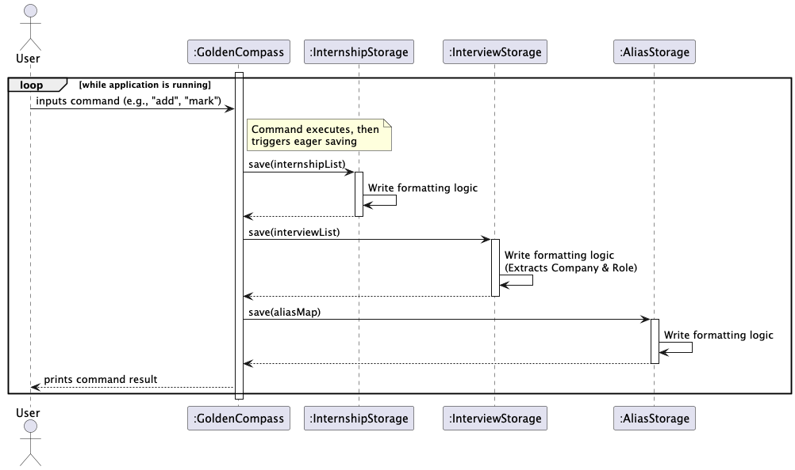

#### Data Validation

Instead of user input validation, the Storage component implements data validation when loading from the text files to prevent crashes from manually edited or corrupted files:

| Validation Layer | Description | Handling Strategy |
|-----------------|-------------|-------------------|
| **Length Check** | Verifies a line splits into the correct number of parts via the `" | "` delimiter. | Skips the line and logs a warning if `parts.length` is invalid. |
| **Empty Value Check** | Ensures parsed titles and company names are not empty strings. | Skips the line to prevent creating ghost internships. |
| **Date Format Check** | Verifies interview dates conform to `LocalDateTime` ISO formatting. | Catches `DateTimeParseException`, logs a warning, but still loads the interview without a date. |

#### Defensive Programming Features

The implementation includes several defensive programming measures:

**1. Assertions**: Verify internal state invariants before executing I/O operations.
assert filePath != null && !filePath.trim().isEmpty() : "Storage file path cannot be null or empty";
assert internshipList != null : "Cannot save a null InternshipList";

**2. Logging**: Track file creation and data corruption for debugging.
logger.log(Level.INFO, "Created missing data directory.");
logger.log(Level.WARNING, "Skipped corrupted line: " + line);

**3. Directory Auto-Creation**: The system proactively checks if the `data/` folder exists before attempting to write. If missing, it uses `parentDir.mkdirs()` to create it, preventing `FileNotFoundException`.

**4. Graceful Exception Handling**: Standard `IOException` and `FileNotFoundException` errors are caught and handled. Instead of crashing the application, it alerts the user or starts with a fresh empty list.

#### Design Considerations

**Aspect: Saving Strategy**

* **Alternative 1 (Current Implementation): Eager Saving (Save on every loop)**
  * **Description:** Inside `GoldenCompass.run()`, the application saves data to all three text files after every single command execution.
  * **Pros:** Maximum data safety. If the user unexpectedly closes the terminal, experiences a power outage, or encounters a fatal runtime exception, no data is lost because the disk is always synchronized with the RAM.
  * **Cons:** Higher disk I/O overhead, as the application rewrites the entire file even if a command didn't actually change any data (e.g., after a `list` command).

* **Alternative 2: Lazy Saving (Save on exit)**
  * **Description:** The `save()` methods are only called once when the user types the `bye` command.
  * **Pros:** Better performance due to minimized file I/O operations.
  * **Cons:** High risk of data loss. If the application terminates abnormally, all progress made during that session is wiped out.

**Aspect: Relational Data Mapping (Interviews to Internships)**

* **Alternative 1 (Current Implementation): Foreign Key Reference by Company Name**
  * **Description:** `InterviewStorage` saves only the Company Name and the Date. Upon loading, it searches the previously loaded `InternshipList` for an exact company name match (`findInternshipByCompany`) to rebuild the object reference in memory.
  * **Pros:** Prevents data duplication. Keeps the `interviews.txt` file clean and concise, adhering to the Single Source of Truth principle.
  * **Cons:** Requires `InternshipList` to be fully loaded *before* `InterviewList` can be loaded.

* **Alternative 2: Deep Copy Storage**
  * **Description:** `InterviewStorage` saves all details of the parent `Internship` alongside the interview date.
  * **Pros:** Easier to parse since `InterviewStorage` wouldn't need access to `InternshipList`.
  * **Cons:** Violates the DRY (Don't Repeat Yourself) principle. If an internship status is updated, it would have to be updated in both files.

#### Test Coverage

The storage components are covered by unit tests to ensure file I/O reliability:

| Test Case | Description | Expected Outcome |
|-----------|-------------|------------------|
| `save_validList_writesCorrectly` | Save a list with one item, then read the file manually | File contains the exact formatted string |
| `load_missingFile_returnsEmptyList` | Attempt to load when `data/` does not exist | Returns empty list, creates directory |
| `load_corruptedFile_skipsLines` | Load a file with missing `|` delimiters | Skips bad lines, loads valid lines |
| `load_invalidDate_handlesGracefully` | Load interview with date `abc` | Interview loaded, date remains null |

## Product scope
### Target user profile

Year 2 computer engineering students applying for internship / EG3611A students (given 5-day deadline to accept offer, 
managing jobs from both TalentConnect and LinkedIn)?


### Value proposition

Applying for internships often involves managing many applications at the same time, each with different roles, 
deadlines, resume versions, and requirements. Students typically track this information using spreadsheets, notes, 
or memory, which can become disorganized and error-prone as the number of applications increases.


## User Stories

| Version | As a ... | I want to ...                                                  | So that I can ...                                                              |
|---------|----------|----------------------------------------------------------------|--------------------------------------------------------------------------------|
| v1.0    | new user | see usage instructions                                         | refer to them when I forget how to use the application                         |
| v1.0    | user     | add an internship application                                  | keep track of the roles I've applied for                                       |
| v1.0    | user     | add an interview linked to an internship                       | track my upcoming interviews alongside my applications                         |
| v1.0    | user     | set a date and time for an interview                           | remember when each interview is scheduled                                      |
| v1.0    | user     | add and remove short alias for commands                        | customize command words that are easy to remember                              |
| v1.0    | user     | list all applications                                          | I can see my progress at a glance                                              |
| v2.0    | user     | search interviews by company, role, or date                    | quickly find specific interviews without scrolling the full list               |
| v2.0    | user     | clear all rejected internships at once                         | declutter my list and focus on active applications                             |
| v2.0    | user     | update the date of an existing interview                       | correct or reschedule an interview without deleting and re-adding it           |
| v2.0    | user     | undo and redo certain operations                               | correct mistakes in typing the commands                                        |
| v2.0    | user     | delete an application                                          | my list stays updated, clean and accurate                                      |
| v2.0    | user     | delete an interview                                            | my list stays updated, clean and accurate                                      |
| v2.0    | user     | search internships by company and role                         | quick find specific internship applications without scrolling the full list    |
| v2.0    | user     | mark an application as offer received                          | easily track my successful applications and decide which internship to accept  |
| v2.0    | user     | mark an application as offer rejected                          | filter them out and focus my attention on my pending applications              |
| v2.0    | user     | have my application data to be automatically saved when I exit | keep tracking my internship application progress between sessions              |
| v2.0    | user     | list upcoming interviews in a specific number of days          | prepare for each of the interviews in advance                                  |

## Non-Functional Requirements

1. Should work on any mainstream OS (Windows, macOS, Linux) as long as Java 17 or above is installed.
2. A user with above-average typing speed should be able to accomplish most tasks faster than using a GUI-based application.
3. The application should respond to any command within 1 second on a typical modern computer.
4. Data files should be human-readable plain text so that advanced users can inspect or edit them manually.

## Glossary

* *Internship* - A tracked internship application, consisting of a company name and role title.
* *Interview* - A scheduled interview linked to an internship, with an optional date and time.
* *Flag* - A command parameter prefix starting with `/` (e.g., `/d`, `/c`, `/t`).
* *Index* - A 1-based position number referring to an item in the displayed list.

## Instructions for manual testing

### Adding an internship

1. Prerequisites: None. (Can be tested on an empty or populated list).
2. Test case: `add Grab /t Software Engineer`
   Expected: Internship added to the list. A success message is printed showing the company and title.
3. Test case: `add /t Software Engineer`
   Expected: Error message indicating the company name cannot be empty.
4. Test case: `add Grab`
   Expected: Error message indicating an invalid flag or missing title.
5. Test case: `add Grab /t`
   Expected: Error message indicating the internship title cannot be empty.
6. Test case: `add    Google    /t    Data Analyst   `
   Expected: Internship added successfully, with extra spaces gracefully trimmed from the company name and title.

### Adding an interview

1. Prerequisites: At least one internship exists. Run `add Google /t SWE` to create one.
2. Test case: `add-interview 1 /d 2028-06-15 10:00`
   Expected: Interview added for the 1st internship with the given date-time.
3. Test case: `add-interview 0 /d 2028-06-15 10:00`
   Expected: Error message indicating the index is out of range.
4. Test case: `add-interview 1 /d bad-date`
   Expected: Error message indicating invalid date format.
5. Test case: `add-interview`
   Expected: Error message asking for the index.
6. Test case: `add-interview 1 /d 2020-01-01 10:00`
   Expected: Error message indicating the date is in the past.
7. Test case: Run `add-interview 1 /d 2028-06-15 10:00` again after step 2.
   Expected: Error message indicating the internship already has an interview scheduled.

### Updating interview date

1. Prerequisites: At least one interview exists. Use `list-interview` to verify.
2. Test case: `update-date 1 /d 2025-07-01 09:30`
   Expected: Date of the 1st interview updated to the new date-time.
3. Test case: `update-date 1 /d 2025-13-01 10:00`
   Expected: Error message indicating invalid date format.
4. Test case: `update-date 999 /d 2025-07-01 09:30`
   Expected: Error message indicating the index is out of range.

### Searching interviews

1. Prerequisites: Multiple interviews exist with different companies and dates.
2. Test case: `search-interview /c Google`
   Expected: Lists all interviews whose company name contains "Google" (case-insensitive).
3. Test case: `search-interview /t Engineer /d 2025-06-15`
   Expected: Lists interviews matching both the role and date criteria.
4. Test case: `search-interview /c NonExistentCompany`
   Expected: Message indicating no interviews found.
5. Test case: `search-interview`
   Expected: Error message asking for at least one search flag.

### Clearing rejected internships

1. Prerequisites: Mark at least one internship as rejected using `reject INDEX`.
2. Test case: `clear-rejected`
   Expected: All rejected internships are removed, along with their associated interviews. A summary is printed.
3. Test case: Run `clear-rejected` again when no rejected internships remain.
   Expected: Message indicating nothing to clear.
4. Test case: Add an internship, add an interview to it, reject it, then run `clear-rejected`.
   Expected: Both the internship and its interview are removed. Verify with `list` and `list-interview`.

### Marking an internship as offer received

1. Prerequisites: At least one internship exists in the tracker. Run `add Grab /t Software Engineer` if the list is empty, then use `list` to view it.
2. Test case: `mark 1`
   Expected: The 1st internship is updated, and a congratulatory message is printed showing its new `[OFFER RECEIVED]` status.
3. Test case: `mark 0`
   Expected: Error message indicating the index is invalid or out of bounds.
4. Test case: `mark 999` (assuming your list has fewer than 999 items)
   Expected: Error message indicating the index is invalid or out of bounds.
5. Test case: `mark abc`
   Expected: Error message indicating that the index must be a number.
6. Test case: `mark`
   Expected: Error message asking to provide the index of the internship.

### Marking an internship as rejected

1. Prerequisites: At least one internship exists in the tracker. Run `add Google /t Data Analyst` if the list is empty, then use `list` to view it.
2. Test case: `reject 1`
   Expected: The 1st internship is updated, and a confirmation message is printed showing its new `[REJECTED]` status along with the "Rejection builds character!" quote.
3. Test case: `reject 0`
   Expected: Error message indicating the index is invalid or out of bounds.
4. Test case: `reject 999` (assuming your list has fewer than 999 items)
   Expected: Error message indicating the index is invalid or out of bounds.
5. Test case: `reject abc`
   Expected: Error message indicating that the index must be a number.
6. Test case: `reject`
   Expected: Error message asking to provide the index of the internship.

### Saving and Loading Data (Storage)

1. Prerequisites: Ensure the application is not running and delete the `data` folder in the project root directory if it exists. Start the application, add an internship (`add Grab /t SWE`), schedule an interview for it (`add-interview 1 /d 2026-05-10 10:00`), and create a custom alias (`alias /c list /a ls`).
2. Test case: Run `bye` to exit the application.
   Expected: The application exits successfully. A `data` folder is automatically created, containing `internships.txt`, `interviews.txt`, and `alias.txt`, with all your entered data safely stored inside.
3. Test case: Restart the application. Run `list`, then `list-interview`, and finally type your custom alias `ls`.
   Expected: The application successfully loads all relational data. The Grab internship and its interview date appear correctly, and typing `ls` successfully triggers the list command.

### Listing all interviews

1. Test case: `list-interview`

   Expected: If there are interviews added, it should list all interviews; 
    otherwise it should print "You don't have any interviews!"

### Listing upcoming interviews

1. Test case: `upcoming`

   Expected: If there are interviews added, it should list all interviews in the upcoming 5 days (starting from and 
    including the current system time); otherwise it should print "You don't have any upcoming interviews."
2. Test case: `upcoming N`, where `N` is a strictly positive integer

   Expected: If there are interviews added, it should list all interviews in the upcoming `N` days (starting from and
   including the current system time); otherwise it should print "You don't have any upcoming interviews."
3. Test case: `upcoming N`, where `N` is a negative integer or `0`

   Expected: It should always print "You don't have any upcoming interviews."