# Developer Guide

## Acknowledgements

{list here sources of all reused/adapted ideas, code, documentation, and third-party libraries -- include links to the original source as well}

## Design & implementation

{Describe the design and implementation of the product. Use UML diagrams and short code snippets where applicable.}

### Internship Management — Class Overview

The following class diagram shows the key classes involved in internship management and their relationships.

Each `AddInternshipCommand` holds a reference to the `Parser` and the `InternshipList`.
The command relies on the `Parser` to extract user inputs and writes the newly created `Internship` directly to the `InternshipList`.

### Add Internship Feature

#### Overview

The `add` command allows the user to create a new internship application in the tracker.
The user specifies the company name and the role title, and the system creates an `Internship` object
and adds it to the `InternshipList`.

**Command format:** `add COMPANY_NAME /t ROLE_TITLE`

**Example:** `add Grab /t Software Engineer` creates an internship at Grab for a Software Engineer role.

#### Implementation

The feature is implemented in `AddInternshipCommand`, which implements the `Command` interface.
When `execute()` is called, it performs the following steps:

1. Retrieves the company name parameter from the `Parser` using `getParamsOf("add")`.
2. Retrieves the role title parameter from the `Parser` using `getParamsOf("/t")`.
3. Validates that the company name parameter is present and not an empty string.
4. Validates that the `/t` flag is present and that the title text is not empty.
5. Throws a `GoldenCompassException` with an accumulated error message if any validation steps fail.
6. Creates a new `Internship` object using the validated company name and title.
7. Adds the newly created `Internship` to the `InternshipList`.
8. Prints a confirmation message to the user via the `Ui`.

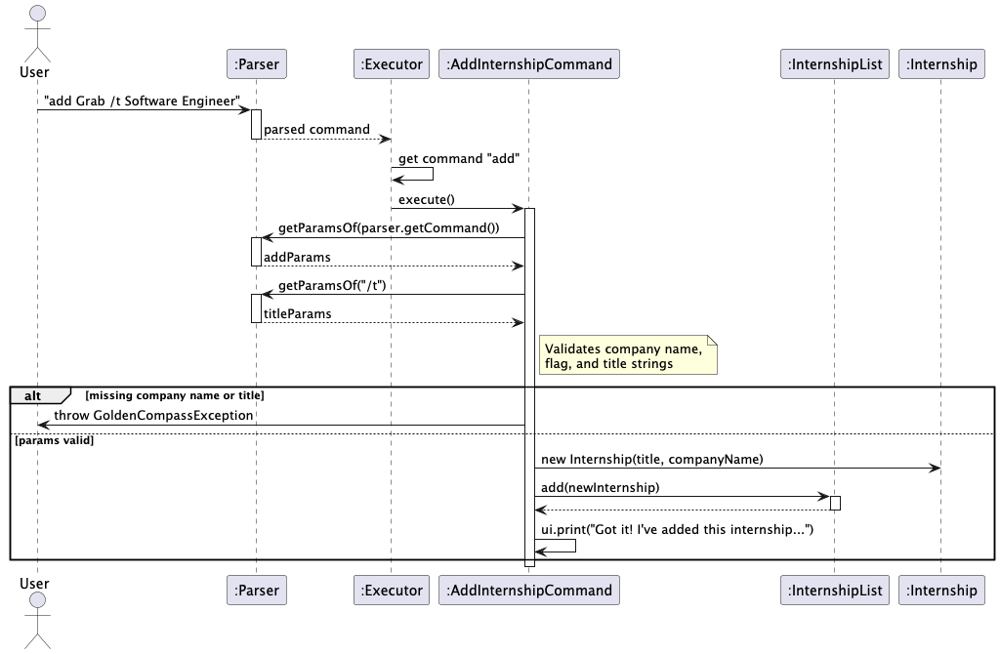

#### Design Considerations

**Aspect: Input Validation and Error Handling Strategy**

* **Alternative 1 (Current Implementation): Error Accumulation**
  * **Description:** The command checks all potential failure points (missing company name, missing `/t` flag, empty title) and collects all error messages into a single `StringBuilder`. If the builder is not empty at the end of the checks, it throws one consolidated `GoldenCompassException`.
  * **Pros:** Significantly improves User Experience (UX). If a user makes multiple syntax mistakes, they are informed of all of them at once, rather than having to fix one error just to be immediately hit by another.
  * **Cons:** Slightly more verbose code, as it requires setting up a `StringBuilder` and using `if` blocks that don't immediately return.

* **Alternative 2: Fail-Fast Validation**
  * **Description:** The command throws a `GoldenCompassException` immediately upon encountering the very first invalid input and halts execution.
  * **Pros:** Simpler and shorter code. Execution stops immediately, saving minor amounts of processing time.
  * **Cons:** Frustrating UX. A user who forgets both the company name and the `/t` flag will only see the "missing company name" error. After fixing it and pressing enter, they will be hit with the "missing flag" error, creating an annoying "whack-a-mole" experience.

### Interview Management — Class Overview

The following class diagram shows the key classes involved in interview management and their relationships.

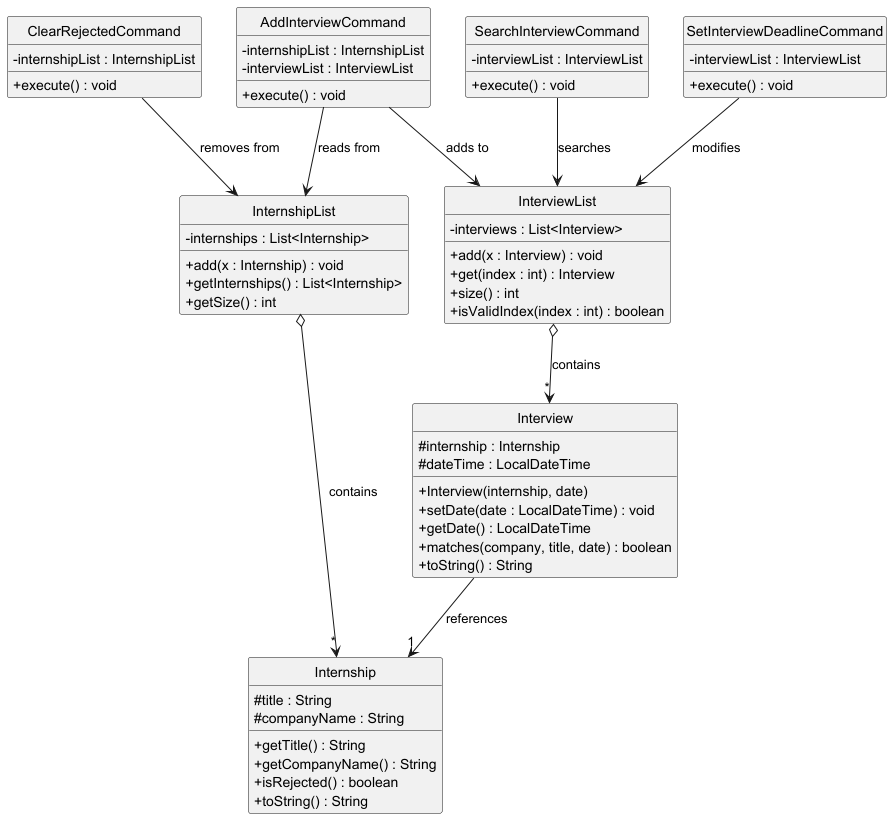

Each `Interview` holds a reference to the `Internship` it is associated with.
`AddInterviewCommand` bridges the two lists — it reads from `InternshipList` and writes to `InterviewList`.
`SetInterviewDeadlineCommand` only needs access to `InterviewList` since it modifies an existing interview.

### Add Interview Feature

#### Overview

The `add-interview` command allows the user to create an interview linked to an existing internship.
The user specifies the 1-based index of the internship and a date-time, and the system creates an
`Interview` object referencing that `Internship` and adds it to the `InterviewList`.

**Command format:** `add-interview INDEX /d DATE`

**Example:** `add-interview 2 /d 2025-06-15 10:00` creates an interview on 15 Jun 2025 at 10:00
for the 2nd internship in the list.

#### Implementation

The feature is implemented in `AddInterviewCommand`, which extends `Command`.
When `execute()` is called, it performs the following steps:

1. Checks if the `/help` flag is present — if so, prints usage information and returns.
2. Retrieves the index parameter from the `Parser` using `getParamsOf(COMMAND_WORD)`.
3. Retrieves the date parameter from the `Parser` using `getParamsOf("/d")`.
4. Validates that both parameters are present and non-empty.
5. Parses the index as an integer and checks it is within the range `[1, internshipList.getSize()]`.
6. Parses the date string into a `LocalDateTime` using the format `yyyy-MM-dd HH:mm`.
7. Retrieves the `Internship` at the 0-based position `(index - 1)` from `InternshipList`.
8. Creates a new `Interview` object linked to that `Internship` with the given date-time.
9. Adds the `Interview` to the `InterviewList`.
10. Prints a confirmation message to the user.

The following sequence diagram illustrates the execution flow when the user enters
`add-interview 2 /d 2025-06-15 10:00`:

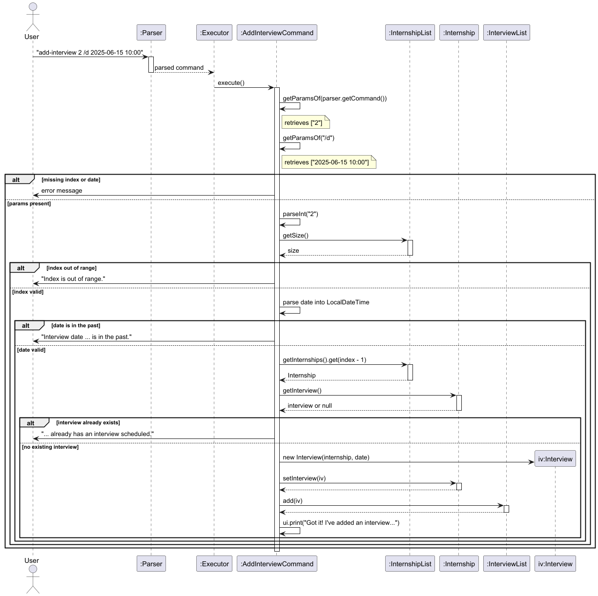

#### Design Considerations

**Aspect: How to link an Interview to an Internship**

- **Alternative 1 (current choice):** Store a reference to the `Internship` object inside `Interview`.
    - Pros: Simple, direct access to internship details (e.g., company name, title) without extra lookups.
    - Cons: If the `Internship` object is modified or removed, the `Interview` still holds the old reference.

- **Alternative 2:** Store only the internship index and look it up when needed.
    - Pros: Always reads the latest internship data.
    - Cons: Fragile if the internship list is reordered or items are deleted, since the stored index may become invalid.

**Aspect: Date-time format**

- **Alternative 1 (current choice):** Use `yyyy-MM-dd HH:mm` format with `LocalDateTime`.
    - Pros: Includes both date and time, giving users precise scheduling control.
    - Cons: Longer input required from the user.

- **Alternative 2:** Use `yyyy-MM-dd` format with `LocalDate` (date only).
    - Pros: Shorter input.
    - Cons: Cannot differentiate between interviews on the same day at different times.

### Update Interview Date Feature

#### Overview

The `update-date` command allows the user to set or update the date and time of an existing interview.
The user specifies the 1-based index of the interview and a date-time in `yyyy-MM-dd HH:mm` format.

**Command format:** `update-date INDEX /d DATE`

**Example:** `update-date 1 /d 2025-04-15 14:00` sets the date of the 1st interview to
April 15, 2025 at 14:00.

#### Implementation

The feature is implemented in `SetInterviewDeadlineCommand`, which extends `Command`.
When `execute()` is called, it performs the following steps:

1. Checks if the `/help` flag is present — if so, prints usage information and returns.
2. Retrieves the index parameter from the `Parser` using `getParamsOf(COMMAND_WORD)`.
3. Retrieves the date parameter from the `Parser` using `getParamsOf("/d")`.
4. Validates that both parameters are present and non-empty.
5. Parses the index as an integer and checks it is within valid range using `interviewList.isValidIndex()`.
6. Parses the date string into a `LocalDateTime` using the format `yyyy-MM-dd HH:mm`.
7. Sorts the interview list and retrieves the `Interview` at the 0-based position `(index - 1)`.
8. Calls `interview.setDate(date)` to update the date-time.
9. Prints a confirmation message to the user.

The following sequence diagram illustrates the execution flow when the user enters
`update-date 1 /d 2025-04-15 14:00`:

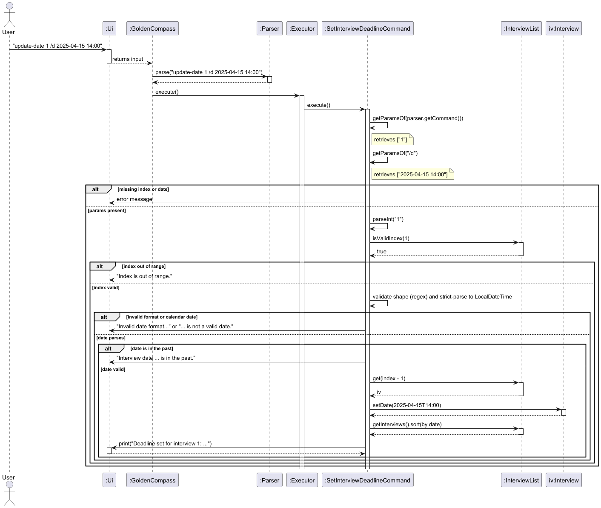

#### Design Considerations

**Aspect: How to identify which interview to update**

- **Alternative 1 (current choice):** Use a 1-based index from the displayed interview list.
    - Pros: Consistent with other commands (e.g., `add-interview` uses an index). Simple for the user to type.
    - Cons: The user must run `list-interview` first to know the index.

- **Alternative 2:** Identify by internship name or interview description.
    - Pros: More intuitive — the user does not need to memorise or look up an index.
    - Cons: Ambiguous if multiple interviews share the same internship name. Requires more complex matching logic.

**Aspect: How to accept the date input**

- **Alternative 1 (current choice):** Use a `/d` flag to separate the date from the index parameter.
    - Pros: Consistent with the existing flag-based command framework. Clear separation of arguments.
    - Cons: Slightly more verbose for the user.

- **Alternative 2:** Accept the date as a positional argument (e.g., `update-date 1 2025-04-15 14:00`).
    - Pros: Shorter command for the user.
    - Cons: Breaks the flag-based convention used by other commands, making the parser inconsistent.

### Search Interview Feature

#### Overview

The `search-interview` command allows the user to search for interviews by company name, role,
and/or date. Multiple flags narrow the results using AND logic. Text matching is case-insensitive
substring matching, while date matching is an exact match on the date portion.

**Command format:** `search-interview [/c COMPANY] [/t ROLE] [/d DATE]`

**Example:** `search-interview /c Google /d 2025-06-15` finds all interviews at companies
containing "Google" on 15 Jun 2025.

#### Implementation

The feature is implemented in `SearchInterviewCommand`, which extends `Command`.
When `execute()` is called, it performs the following steps:

1. Checks if the `/help` flag is present — if so, prints usage information and returns.
2. Retrieves the optional parameters for `/c`, `/t`, and `/d` from the `Parser`.
3. Extracts each keyword, treating blank or missing values as `null`.
4. Validates that at least one search flag is provided.
5. If a `/d` value is provided, parses it into a `LocalDate` (format `yyyy-MM-dd`).
6. Filters the interview list using `Interview.matches(company, title, date)`, which applies
   AND logic across all non-null criteria.
7. Prints the matching results, or a "no results" message if none match.

The filtering relies on the `matches()` method in `Interview`, which uses direct field access
to `internship.companyName` and `internship.title` for case-insensitive substring matching,
and compares dates via `dateTime.toLocalDate().equals(date)`.

The following sequence diagram illustrates the execution flow when the user enters
`search-interview /c Google`:

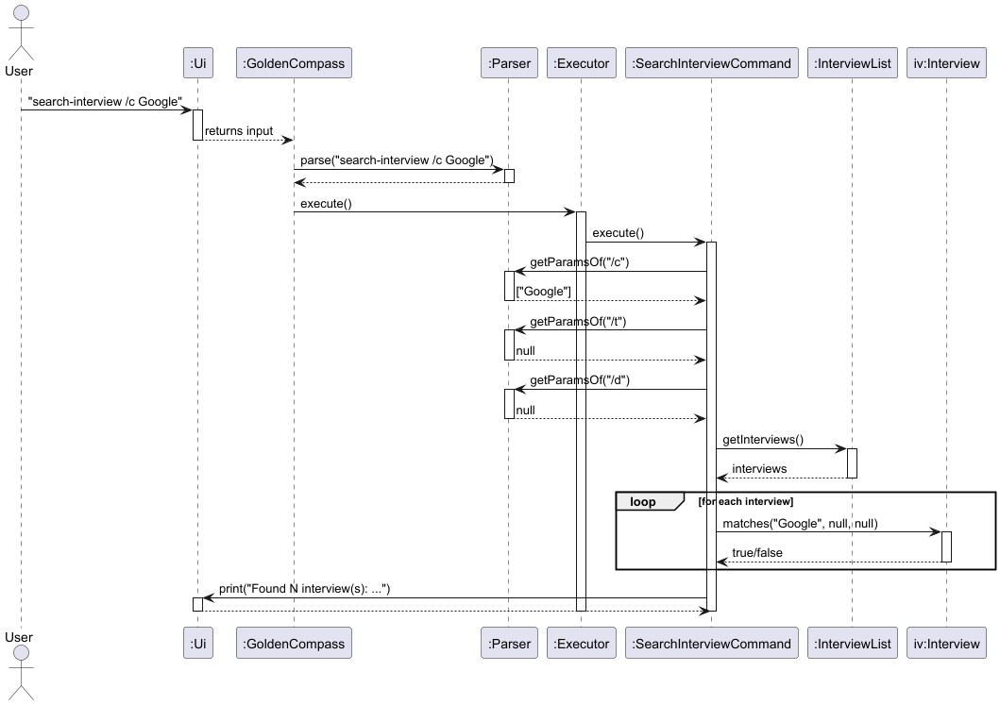

#### Design Considerations

**Aspect: Single filter vs. combined filters**

- **Alternative 1 (current choice):** Support multiple optional flags with AND logic.
    - Pros: Flexible — users can narrow results progressively. One command handles all search needs.
    - Cons: Slightly more complex parsing and validation logic.

- **Alternative 2:** Separate commands for each search type (e.g., `search-by-company`, `search-by-date`).
    - Pros: Each command is simpler.
    - Cons: More commands to learn. Cannot combine filters without chaining commands.

**Aspect: Where to place the filtering logic**

- **Alternative 1 (current choice):** Delegate filtering to `Interview.matches()`.
    - Pros: Encapsulates matching logic in the domain object. The command class stays clean
      and focused on orchestration.
    - Cons: The `Interview` class takes on matching responsibility.

- **Alternative 2:** Perform all filtering inline in the command class.
    - Pros: All logic in one place.
    - Cons: Harder to reuse the matching logic from other commands.

### Clear Rejected Feature

#### Overview

The `clear-rejected` command removes all internships that have been marked as rejected from the
tracker. This helps users declutter their list by removing entries they no longer need to track.

**Command format:** `clear-rejected`

**Example:** `clear-rejected` removes all rejected internships and prints a summary of what was removed.

#### Implementation

The feature is implemented in `ClearRejectedCommand`, which extends `Command`.
When `execute()` is called, it performs the following steps:

1. Retrieves the full internship list from `InternshipList`.
2. Filters the list to find all internships where `isRejected()` returns `true`.
3. If no rejected internships are found, prints a message and returns.
4. Removes all rejected internships from the list using `removeAll()`.
5. Prints a summary showing how many were cleared and their details.

#### Design Considerations

**Aspect: Clearing strategy**

- **Alternative 1 (current choice):** Remove all rejected internships at once.
    - Pros: Simple one-step cleanup. No need for the user to identify individual entries.
    - Cons: No selective removal — it is all-or-nothing.

- **Alternative 2:** Allow the user to specify which rejected internships to clear.
    - Pros: More granular control.
    - Cons: Adds unnecessary complexity — if the user wants to keep a rejected entry,
      they likely would not have rejected it in the first place.

### Feature: Listing All Interviews

#### Overview

The user can list all interviews in increasing order of dates such that the earliest interview is shown at the top.

**Command format:** `list-interview`

#### Implementation

The feature is implemented in `ListInterviewCommand`, the relationship of which to other classes is shown in the following class diagram 

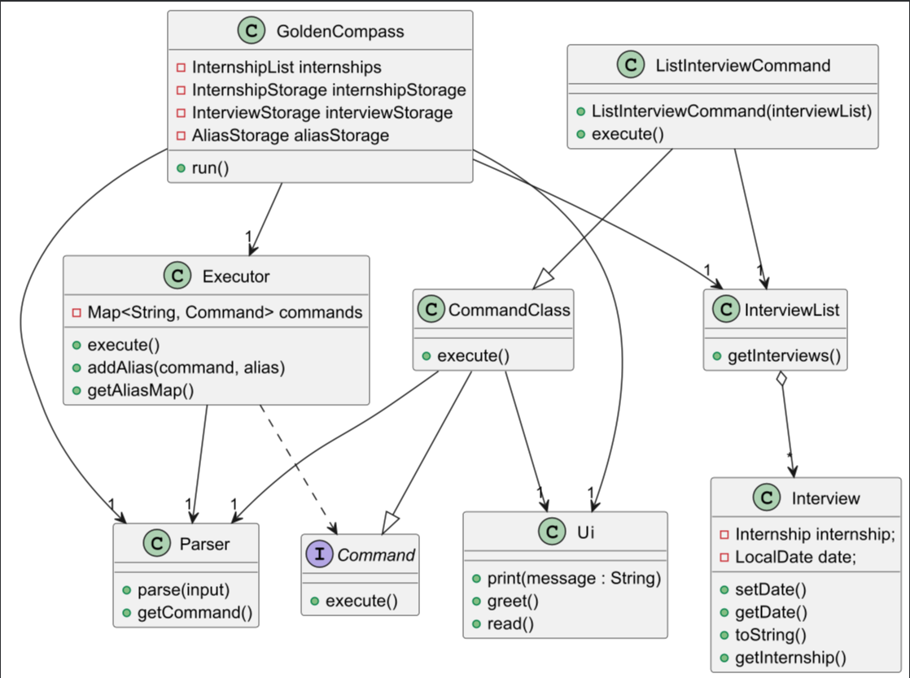

The following sequence diagram illustrates `ListInterviewCommand::execute()`

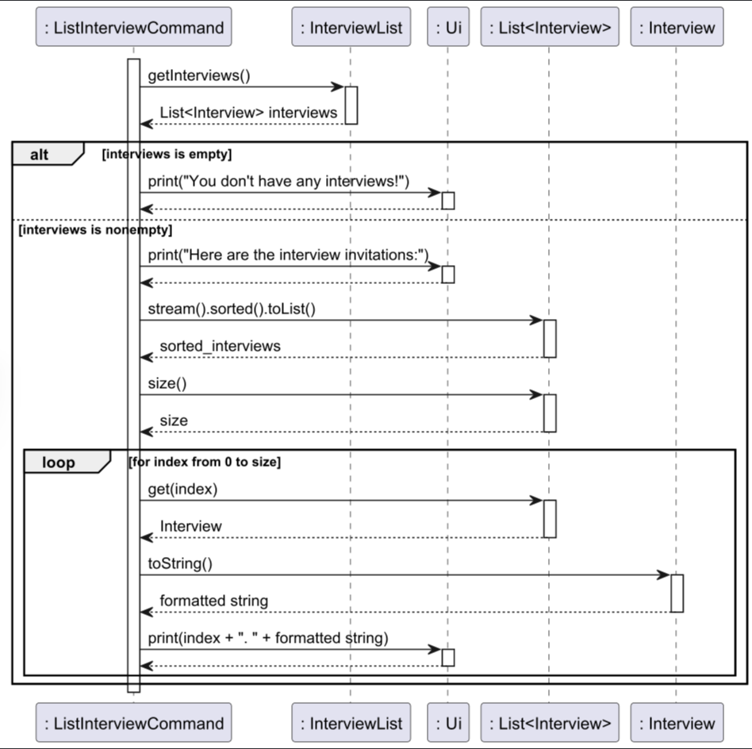

### Delete Internship Feature

#### Overview

The `delete` command allows the user to remove an existing internship application from the tracker.
The user specifies the 1-based index of the internship to delete, and the system removes the corresponding `Internship` object from the `InternshipList`.

**Command format:** `delete INDEX`

**Example:** `delete 2` removes the 2nd internship from the list.

#### Implementation

The delete feature is implemented in `DeleteInternshipCommand`, which extends `CommandClass`. The command is pre-registered in the `Executor`'s command lookup map during application initialization.

When the user enters `delete 2`, the execution flow is as follows:

1. The `Parser` parses the user input, extracting the command word "delete" and the argument "2".
2. The `Executor` retrieves the command word and looks up the corresponding `Command` instance from its internal `Map<String, Command>` using `commands.get("delete")`.
3. The `Executor` calls `execute()` on the retrieved `DeleteInternshipCommand` instance (no new command object is created).
4. `DeleteInternshipCommand` retrieves the index parameter from the `Parser` using `getParamsOf("delete")`.
5. The command validates that the parameter is present, is a valid integer, and falls within the range `[1, internshipList.getSize()]`.
6. The command retrieves the `Internship` at the 0-based position `(index - 1)` from `InternshipList` for logging purposes.
7. The command calls `internshipList.delete(index - 1)` to permanently remove the internship.
8. The command logs the deletion with details of the removed internship.
9. The command prints a confirmation message to the user via the `Ui`.

**Note:** The `Executor` does not instantiate a new command for each execution. Instead, it uses a pre-registered command instance from the lookup map, following the Command Pattern. This design promotes reusability and centralizes command management.

The following class diagram shows the main components involved in the delete internship feature:

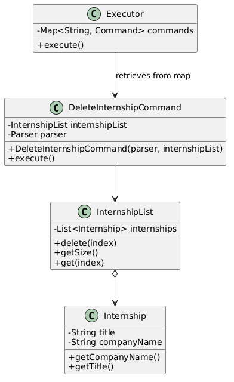

The following sequence diagram illustrates the execution flow when the user enters `delete 2`:

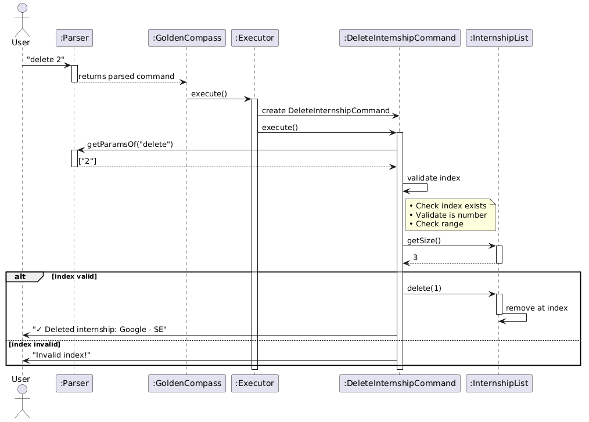

#### Input Validation

The command implements multiple layers of validation to ensure robustness:

| Validation Layer | Description | Example Error Message |
|-----------------|-------------|----------------------|
| **Presence Check** | Verifies that an index was provided | "Please provide the index of the internship to delete! (e.g., delete 1)" |
| **Type Check** | Ensures the index is a valid integer | "The index must be a number! (e.g., delete 1)" |
| **Range Check** | Confirms the index is within the list bounds | "Invalid index! Please enter a number between 1 and 3" |

#### Defensive Programming Features

The implementation includes several defensive programming measures:

**1. Assertions**: Verify internal state invariants
assert internships != null : "Internships list should not be null";
assert size >= 0 : "List size should never be negative";

**2. Logging**: Track execution flow and errors
logger.info("Executing DeleteInternshipCommand");
logger.warning("Invalid index: " + index);
logger.info("Deleted internship at index " + index);

**3. Bounds Checking**: Validate array indices before access
if (index < 0 || index >= internships.size()) {
throw new IndexOutOfBoundsException("Index: " + index);
}

**4. Null Checks**: Prevent NullPointerException
if (internshipList == null) {
throw new IllegalArgumentException("InternshipList cannot be null");
}

#### Design Considerations

**Aspect: Indexing Scheme**

- **Alternative 1 (current choice):** Use 1-based indexing for user input, convert to 0-based internally.
  - **Pros:** More intuitive for users who think of list positions starting from 1.
  - **Cons:** Requires conversion logic and careful handling.

- **Alternative 2:** Use 0-based indexing directly.
  - **Pros:** Matches internal representation, no conversion needed.
  - **Cons:** Less intuitive for users; first item is "0" not "1".

**Aspect: Deletion Strategy**

- **Alternative 1 (current choice):** Immediate permanent deletion.
  - **Pros:** Simple to implement, matches user expectation for "delete" command.
  - **Cons:** No recovery option if user deletes accidentally.

- **Alternative 2:** Soft delete (mark as deleted but keep in storage).
  - **Pros:** Allows undo functionality, data can be recovered.
  - **Cons:** Adds complexity to data model and queries.

**Aspect: Error Handling Strategy**

- **Alternative 1 (current choice):** Fail-fast validation with specific error messages.
  - **Pros:** Clear immediate feedback to users.
  - **Cons:** May require multiple attempts if user makes multiple mistakes.

- **Alternative 2:** Accumulate all validation errors before throwing.
  - **Pros:** User sees all errors at once.
  - **Cons:** More complex error handling logic.

#### Test Coverage

The feature is covered by comprehensive unit tests in `DeleteInternshipCommandTest`:

| Test Case | Description | Expected Outcome |
|-----------|-------------|------------------|
| `delete_firstInternship_removesCorrectly` | Delete index 1 from list of 3 | List size decreases to 2, remaining items shift |
| `delete_middleInternship_removesCorrectly` | Delete index 2 from list of 3 | List size decreases to 2, items reorder correctly |
| `delete_lastInternship_removesCorrectly` | Delete index 3 from list of 3 | List size decreases to 2, last item removed |
| `delete_indexOutOfBounds_throwsException` | Delete index larger than list size | Throws IndexOutOfBoundsException |
| `delete_emptyList_throwsException` | Delete from empty list | Throws IndexOutOfBoundsException |

### Alias
#### Overview 

The `alias` command allows user to add an alias to the default set of command words, while the `remove-alias` command
allows user to remove an existing alias.

#### Command format

`alias /c COMMAND /a ALIAS`

`remove-alias ALIAS`

#### Implementation

These two commands uses `Map`. There is a `Map<String, String>` that maps the set of alias to the set of default command
keyword. For example, alias `"ls"` is mapped to command `"list"`. The output of this map is then mapped to command 
classes as explained above.

`alias` would create a new mapping, while `remove-alias` would remove such a mapping. This is internally achieved
via `executor.addAlias(commandWord, alias)` and `executor.removeAlias(alias)`.

Defensive validation of the user input would be carried out before calling the above methods. This includes the 
**number** of the parameters, and the expected **flags**. 

This is add alias sequence diagram:

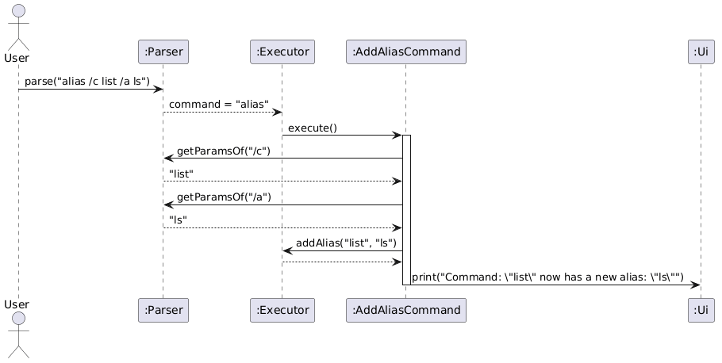

This is remove alias sequence diagram:

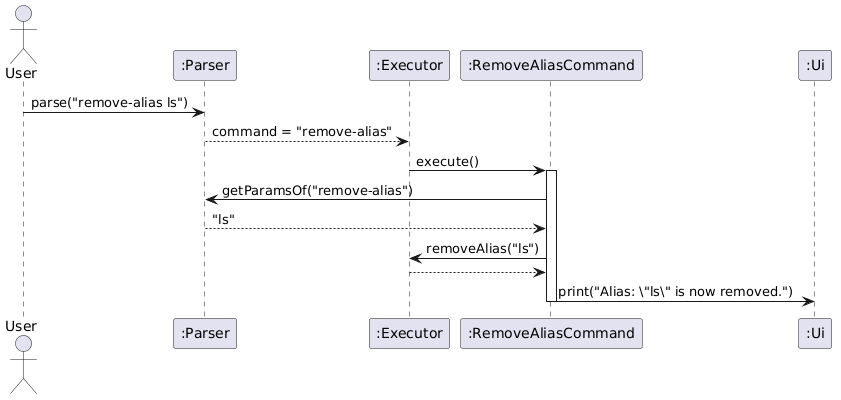
### Data History

#### Overview

The `undo` command allows user to undo an action that modifies the state of the app, i.e, the recorded data, while
the `redo` command allows user to redo an action that has been undone by `undo`. 
User can `undo` for a maximum of `10` times.

#### Command format
`undo`

`redo`

#### Implementation

The mechanism uses the idea of a timeline. A copy of the data is "snapshot" and recorded by `OperationSnapshot` class. 
A container class, `OperationHistory` would store this snapshot via stack. There are `2` stacks: **undo stack** 
and **redo stack**. The undo stack's top is always the **current** data version. The redo stack's top is always the
latest data version that has been **undone**.

After each action (command) that is **undoable**, a snapshot would be taken, and pushed into undo stack. The redo
stack would be **cleared** at the same time. This is because conflict of data history would arise when trying to redo 
after new changes.

To undo an action, the top snapshot in undo stack would be popped into the redo stack, and the new top in undo stack
gets peeked by returning its reference. Then, the current data in the app would be replaced by the data copies in that
reference.

To redo an action, the top snapshot in redo stack is popped into the undo stack and its reference is also returned.
The current data of the app would be replaced by the data copies in that reference.

This is undo sequence diagram:
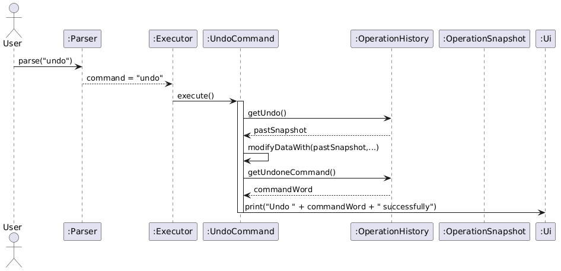

This is redo sequence diagram:
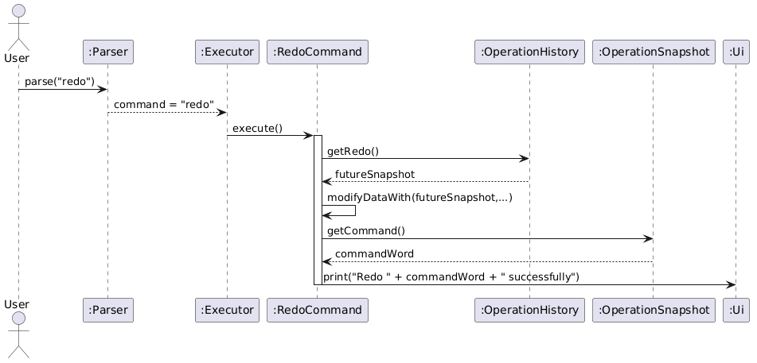

### Future Enhancements

Potential improvements for future versions:

1. **Batch deletion**: Support multiple indices (e.g., `delete 1,3,5`)
2. **Range deletion**: Delete a range of internships (e.g., `delete 1-5`)
3. **Confirmation prompt**: Ask for confirmation before deleting to prevent accidents
4. **Archive feature**: Move deleted internships to an archive instead of permanent deletion

### Storage — Component Overview

The following class diagram shows the structure of the `Storage` component and how it interacts with the `Logic` and `Model` layers.

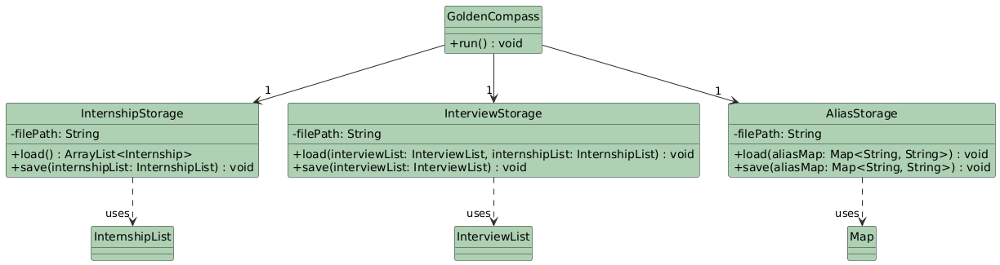

The `Storage` component:
* Saves `InternshipList`, `InterviewList`, and the `ALIAS_MAP` into separate text files.
* Loads data from these files upon application startup.
* Uses a "linked loading" approach: `InterviewStorage` references the `InternshipList` to rebuild the object associations between interviews and their respective companies using the `findInternshipByCompany` helper method.

### Implementation: Persistence

#### Overview

The storage system is implemented through three main classes: `InternshipStorage`, `InterviewStorage`, and `AliasStorage`. These classes handle the conversion of Java objects into a pipe-delimited (`|`) text format to ensure data persists across sessions.

**Data File Locations:**
* `data/internships.txt`: Stores company names and job titles.
* `data/interviews.txt`: Stores interview dates and the linked company names.
* `data/aliases.txt`: Stores user-defined command shortcuts.

#### Execution Flow

When the application starts, `GoldenCompass` initializes the storage classes and triggers the `load()` sequence in a specific order to maintain data integrity:

1.  **Internship Loading**: `InternshipStorage` reads `internships.txt` and populates the `InternshipList`.
2.  **Interview Loading**: `InterviewStorage` reads `interviews.txt`. For each entry, it searches the `InternshipList` for the matching `Internship` object before adding the `Interview` to the `InterviewList`.
3.  **Alias Loading**: `AliasStorage` reads `aliases.txt` and updates the `ALIAS_MAP` in the `Executor`.

The following sequence diagram illustrates the loading process during startup:

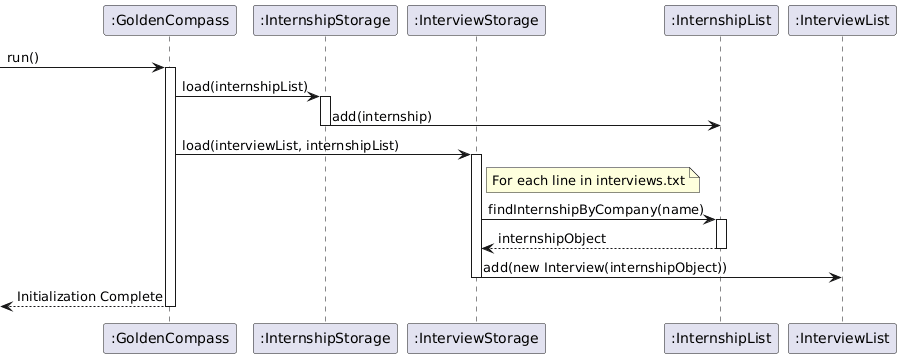

#### Design Considerations

**Aspect: Data Format for Persistence**

* **Alternative 1 (current choice):** Custom Pipe-Delimited Text Format (e.g., `Google | Software Engineer`).
  * **Pros:** Human-readable, easy to debug by opening the file in a text editor, and lightweight without needing external libraries.
  * **Cons:** Requires manual parsing logic and careful handling of the delimiter character if it appears in user input.

* **Alternative 2:** JSON or XML.
  * **Pros:** Standardized format, handles nested data structures easily.
  * **Cons:** Increases project complexity and file size; requires adding external dependencies which may conflict with the project's "no-third-party-library" constraints.

**Aspect: Timing of Save Operations**

* **Alternative 1 (current choice):** Save on Exit.
  * **Pros:** Efficient; only performs Disk I/O operations once per session, reducing performance overhead.
  * **Cons:** Risk of data loss if the application crashes or the terminal is force-closed without using the `bye` command.

* **Alternative 2:** Auto-save after every modification.
  * **Pros:** Maximum data safety; changes are committed immediately.
  * **Cons:** High disk I/O overhead; might lead to minor lag during command execution if the data lists become very large.

## Product scope
### Target user profile

{Describe the target user profile}

### Value proposition

{Describe the value proposition: what problem does it solve?}

## User Stories

|Version| As a ... | I want to ... | So that I can ...|
|--------|----------|---------------|------------------|
|v1.0|new user|see usage instructions|refer to them when I forget how to use the application|
|v1.0|user|add an interview linked to an internship|track my upcoming interviews alongside my applications|
|v1.0|user|set a date and time for an interview|remember when each interview is scheduled|
|v2.0|user|search interviews by company, role, or date|quickly find specific interviews without scrolling the full list|
|v2.0|user|clear all rejected internships at once|declutter my list and focus on active applications|
|v2.0|user|update the date of an existing interview|correct or reschedule an interview without deleting and re-adding it|

## Non-Functional Requirements

1. Should work on any mainstream OS (Windows, macOS, Linux) as long as Java 17 or above is installed.
2. A user with above-average typing speed should be able to accomplish most tasks faster than using a GUI-based application.
3. The application should respond to any command within 1 second on a typical modern computer.
4. Data files should be human-readable plain text so that advanced users can inspect or edit them manually.

## Glossary

* *Internship* - A tracked internship application, consisting of a company name and role title.
* *Interview* - A scheduled interview linked to an internship, with an optional date and time.
* *Flag* - A command parameter prefix starting with `/` (e.g., `/d`, `/c`, `/t`).
* *Index* - A 1-based position number referring to an item in the displayed list.

## Instructions for manual testing

### Adding an interview

1. Prerequisites: At least one internship exists. Run `add Google /t SWE` to create one.
2. Test case: `add-interview 1 /d 2025-06-15 10:00`
   Expected: Interview added for the 1st internship with the given date-time.
3. Test case: `add-interview 0 /d 2025-06-15 10:00`
   Expected: Error message indicating the index is out of range.
4. Test case: `add-interview 1 /d bad-date`
   Expected: Error message indicating invalid date format.
5. Test case: `add-interview`
   Expected: Error message asking for the index.

### Updating interview date

1. Prerequisites: At least one interview exists. Use `list-interview` to verify.
2. Test case: `update-date 1 /d 2025-07-01 09:30`
   Expected: Date of the 1st interview updated to the new date-time.
3. Test case: `update-date 1 /d 2025-13-01 10:00`
   Expected: Error message indicating invalid date format.
4. Test case: `update-date 999 /d 2025-07-01 09:30`
   Expected: Error message indicating the index is out of range.

### Searching interviews

1. Prerequisites: Multiple interviews exist with different companies and dates.
2. Test case: `search-interview /c Google`
   Expected: Lists all interviews whose company name contains "Google" (case-insensitive).
3. Test case: `search-interview /t Engineer /d 2025-06-15`
   Expected: Lists interviews matching both the role and date criteria.
4. Test case: `search-interview /c NonExistentCompany`
   Expected: Message indicating no interviews found.
5. Test case: `search-interview`
   Expected: Error message asking for at least one search flag.

### Clearing rejected internships

1. Prerequisites: Mark at least one internship as rejected using `reject INDEX`.
2. Test case: `clear-rejected`
   Expected: All rejected internships are removed. A summary is printed.
3. Test case: Run `clear-rejected` again when no rejected internships remain.
   Expected: Message indicating nothing to clear.
